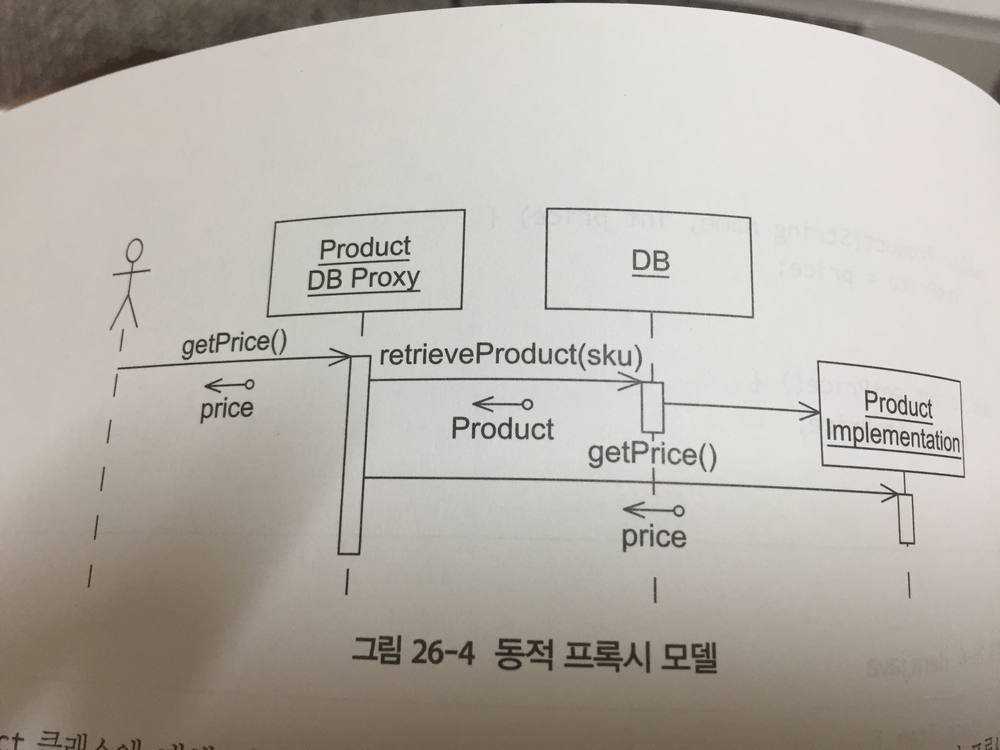

- 소프트웨어 시스템에는 많은 장벽이 있다.
  - 프로그램에서 데이터베이스로 데이터를 옮길때의 장벽
  - 한 컴퓨터에서 다른 컴퓨터로 메시지를 전송할 때는 네트워크 장벽
- 이번 장에서는 해결하려는 문제에 대한 초점을 잃지 않은 채로 이런 장벽을 넘는 일을 도와준다.

## 프록시 패턴

- 어떤 웹사이트에서 쇼핑 카트 시스템을 작성하고 있다고 상상해보자.
- 고객과 주문목록(쇼핑 카트), 주문 목록이 있는 상품 자체를 위한 객체를 포함하고 있을 것이다.

```uml
Customer --> "0..*" Order
Order --> "0..*" Item
Item --> Product
```

- 위 구조는 단순하지만, 목표한 기능은 감당할 수 있을 것이다.

- 주문 목록(Order)에 새 항목(Item)을 더하는 기능을 구현하려면 다음과 같은 코드를 사용할 수 있다.

```java
public class Order {
  private Vector tsItems = new Vector();
  public void addItem(Product p, int qty) {
    Item item = new Item(p, qty);
    itsItems.add(item);
  }
}
```

- 이제 이 객체들이 관계형 데이터베이스에 있는 데이터를 표현한다고 생각해보자.

CUstomer(cusid) --> Order(orderId) --> Item(sku) --> Product

- 위 관계도에서 어떤 특별한 Order에 Item의 행을 한줄 추가하고 싶을 때는 다음과 같은 코드를 사용할 수 있다. 이 코드는 JDBC 호출을 통해 관계형 데이터 모델을 직접 조작하고 있다.

```java
public class AddItemTransaction extends Transaction {
  public void addItem(int orderId, String sku, int qty) {
    Satement s = itsConnection.CreateStatement();
    s.excuteUpdate("insert into items value(" + orderId + "," + sku + "," + qty + ")");
  }
}
```

- 위 코드는 SRP 원칙 (단일책임 원칙)에 대한 중대한 위반이며, CCP 위반 (공통 폐쇄 원칙 - 같은 패키지 안의 클래스들은 동일한 종류의 변화에는 모두 폐쇄적이어야 한다.) 에도 해당될 수 있다.
- 위 코드는 서로 다른 원인에 의해 변하는 두 개념을 섞어 놓고 있다.
  - 항목과 주문 목록의 개념을 관계 스키마 및 SQL 개념과 섞어놓은 것이다.
- 또한 DIP (의존 관계 역전 원칙) 도 위반하고 있는데, 이것은 프로그램의 정책이 저장 메커니즘의 세부적인 부분에 의존하고 있기 때문이다. (직접 의존)
- 프록시 패턴은 이런 결점을 치유하는 한 방법이다.

```java
// testOrderPrice.java
public void testOrderPrice() {
  Order o = new Order("Bob");
  Product toothpaste = new Product("Toothpaste", 129);
  o.addItem(toothpaste, 1);
  asserEquals(129, o.total());
  Product mouthwash = new Product("Mouthwash", 342);
  o.addItem(mothwash,2)
  assertEquals(813, o.total());
}
```

- 다음은 테스트를 수행하기 위한 간단한 코드가 있다.

```java
public class Order {
  public String getCustomerId();
  public void addItem(Product p, int quantity);
  public int total();
}
```

```java
public class Product {
  public int getPrice() throws Exception;
  public String getName() throws Exception;
  public String getSku() throws Exception;
}
```

```java
public class Item {
  private Product itsProduct;
  private int itsQuantity;

  public Item(Product p, int qty) {
    itsProduct = p;
    itsQuantity = qty;
  }

  public Product getProduct() {
    return itsProduct;
  }

  public int getQuantity() {
    return itsQuantity;
  }
}
```


- 프록시 패턴을 적용할 각 객체는 세 부분으로 나뉜다.
  - 첫 번째는 클라이언트가 호출할 필요가 있는 모든 메서드를 선언한 인터페이스
  - 두 번째는 데이터베이스에 대한 지식 없이 이 메소드를 구현하는 클래스 부분이다.
  - 세 번째는 데이터베이스에 대해 알고 있는 프록시(대리인) 부분이다.



- Product 클래스를 인터페이스로 대체함으로써 프록시 패턴을 적용했다.
  - ProductImplementation 클래스는 Product 인터페이스를 구현하고 있다.
  - ProductDBProxy는 Product의 모든 메소드를 구현해 데이터 베이스에서 상품을 가져온다.
  - 그 이후에 ProductImplementation 의 인스턴스를 생성하고, 그 인스턴스에 메시지를 위임한다.
- 클라이언트는 Product라고 생각하는 대상, 하지만 실제로는 ProductDBProxy 인 대상에 getPrice() 메시지를 보낸다.
- ProductProxy는 데이터베이스에서 ProductImplementation 을 가져와서, 그것에 getPrice 메소드를 위임한다.

- 클라이언트나 ProductImplementation 양측 모두 데이터베이스의 존재를 모르고 있는 상태에서 데이터베이스가 애플리케이션에 삽입이 되었다.

현실적으로 프록시를 사용하는건 간단치가 않기 때문에 몇 가지 문제에 대한 개념을 예제로 알아보자.

### 쇼핑 카트 프로그램에 프록시 패턴 적용하기

- 가장 간단한 프록시를 만들 수 있는 것은 Product(상품) 클래스다.
- 본격적으로 시작하기 앞서, 프록시가 사용하기 위한 데이터베이스 유틸리티가 필요하다.

DB Test

```java
public class DBTest extends TestCase {
  public static void main(String[] args) {
    TestRunner.main(new String[]{"DBTest"});
  }

  public DBTest(String name) {
    super(name);
  }

  public void setUp() throws Exception {
    DB.init();
    DB.clear();
  }

  public void tearDown() throws Exception {
    DB.close();
  }

  public void testStoreProduct() throws Exception {
    ProductData storedProduct = new ProductData();
    storedProduct.name = "MyProduct";
    storedProduct.price = 1234
    storedProduct.sku = "9999";
    DB.store(storedProduct);
    ProductData retrievedProduct = DB.getProductData("999");
    assertEquals(storedProduct, retrievedProduct);
  }
}
```

- 프록시 구현의 다음 단계는 이것이 동작하는 방식을 보여주는 테스트 프로그램을 작성하는 것이다.
- 이 테스트는 1개를 데이터베이스에 추가한다. 그런 후, 저장된 상품의 sku로 ProductProxy를 생성하고, 프록시에서 데이터를 얻기 위해 Product의 접근 메소드를 사용하려고 시도한다.

```java
public class ProxyTest extends TestCase {
  public static void main(String[] args) {
    TestRunner.main(new String[]{"ProxyTest"});
  }

  public ProxyTest(String name) {
    super(name);
  }

  public void setUp() throws Exception {
    DB.init();
    DB.clear();
    DB.store(new ProductData("ProxyTestName1",456,"ProxyTest1"));
  }

  public void tearDown() throws Exception {
    DB.close();
  }

  public void testProductProxy() throws Exception {
    Product p = new ProductProxy("ProxyTest1");
    assertEquals(456, p.getPrice());
    assertEquals("ProxyTestName1", p.getName());
    assertEquals("ProxyTest1", p.getSku());
  }
```

```java
public class ProductData {
  public String name;
  public int price;

  public ProductData() {}

  public ProductData(String name, int price, String sku) {
    this.name = name;
    this.price = price;
    this.sku = sku;
  }

  public String sku;

  public boolean equals(Object o) {
    ProductData pd = (ProductData)o;
    return name.equals(pd.name) && sku.equals(pd.sku) && price==pd.price;
  }
  public String toString() {
    return ("ProductData("+sku+","+name+","+price+")");
  }
}
```

- 이것이 제대로 동작하기 위해서는 Product 의 인터페이스를 실제 구현 부분과 분리해야 한다.
- Product를 인터페이스로 바꾸고 그것을 실제로 구현하기 위해 ProductImp를 만들었다.

```java
public interface Product {
  public int getPrice() throws Exception;
  public String getName() throws Exception;
  public String getSku() throws Exception;
}
```

- Product 인터페이스에 예외를 추가한 것은 Product, ProductImp, ProxyTest를 작성함과 동시에 ProductProxy를 작성했기 때문이다.
- ProductProxy 클래스는 데이터베이스를 호출하고, 그 데이터베이스는 예외를 발생시킨다. 이런 예외들이 프록시에 의해 처리되고 감춰지는 것을 바라지 않았기 때문에, 인터페이스에서 빠져나가도록 하는 방법을 택했다.

```java
public class ProductImp implements Product {
  private int itsPrice;
  private String itsName;
  private String itsSku;

  public ProductImp(String sku, String name, int price) {
    itsPrice = price;
    itsName = name;
    itsSku = sku;
  }

  public int getPrice() {
    return itsPrice;
  }

  public String getName() {
    return itsName;
  }

  public String getSku() {
    return itsSku;
  }
}
```

```java
public class ProductProxy implements Product {
  private String itsSku;
  public ProductProxy(String sku) {
    itsSku = sku;
  }
  public int getPrice() throws Exception {
    ProductData pd = DB.getProductData(itsSku);
    return pd.price;
  }

  public String getName() throws Exception {
    ProductData pd = DB.getProductData(itsSku);
    return pd.name;
  }

  public String getSku() throws Exception {
    return itsSku;
  }
}
```

- 위 코드는 원래 우리가 의도 했던 프록시 패턴과는 일치하지 않는다. 
- 이것은 위 사진 처럼 패턴의 정규형과 일치 하지 않는다. 원래 의도는 프록시 패턴을 구현하려는 것이었으나, 정작 그것이 실체화되고 난 뒤에는 정규형 패턴은 잘못돼버렸다.

- 정규형 패턴에서는 ProductProxy 로 하여금 모든 메소드에서 ProductImp를 생성하게 했을 것이다.
- 그리고 난뒤, productImp에 위임했을 것이다.

```java
public int getPrice() throws Exception {
  ProductData pd = DB.getProductData(itsSku);
  ProducImp p = new ProductImp(pd,sku, pd.name, pd.price);
  return p.getPrice();
}
```

- 여기서 ProductProxy는 이미 ProductImp 접근 메소드가 반환할 데이터를 갖고 있기에 ProductImp를 생성하고 위임할 필요가 전혀 없는것이다.
- ProducyProxy 코드에선 sku 때문에 데이터베이스를 건드리지도 않는다. 이미 sku를 가지고 있기 때문이다.
- ProducyProxy의 구현은 각 접근 메소드에 대해 일일이 데이터베이스에 접근하고 있어서 매우 비효율적인 것처럼 보일지도 모른다.
- 여기서는 일부러 골치 아픈 문제를 만들어내기 보다는 성능 문제가 겉으로 드러날 때까지 기다려야만 한다.

#### 관계에 프록시 패턴 적용하기

- 다믕 단계는 Order에 대한 프록시를 만드는 것이다. 각 Order 인스턴스는 많은 Item 인스턴스를 포함하고 있다.
- 관계형 스키마에서 이 관계는 Item 테이블 안에 기록되어 있다. Item 의 각 행은 그것을 포함하고 있는 Order의 키를 저장한다.
- 그러나 객체 모델에서 관계는 Order 안에 있는 Vector에 의해 구현된다. 어떻게든 프록시는 2개의 형식을 변환해야만 한다.
- 테스트는 데이터베이스에 몇개의 더미 상품을 추가한다. 그리고 프록시가 이 상품을 갖게 하고, 그것을 사용해 OrderProxy에 있는 addItem을 호출한다.
- 마지막으로 OrderProxy에 전체 가격을 요청한다.
- 이 테스트 케이스의 목적은 OrderProxy가 마치 Order처럼 동작하기는 하지만, 메모리에 있는 객체가 아니라 데이터베이스에서 그 데이터를 얻는 다는 것을 보여주는데 있다.

```java
// ProxyTest.java
 public void testOrderProxyTotal() throws Exception {
  DB.store(new ProductData("Wheaties", 349, "wheaties"));
  DB.store(new ProductData("Crest", 258, "crest"));
  ProductProxy wheaties = new ProductProxy("wheaties");
  ProductProxy crest = new ProductProxy("crest");
  OrderData od = DB.newOrder("testOrderProxy");
  OrderProxy order = new OrderProxy(od.orderId);
  order.addItem(crest, 1);
  order.addItem(wheaties, 2);
  assertEquals(956, order.total());
}
```

- DB의 newOrder 메소드는 OrderData 의 인스턴스를 반환한다.
- OrderData는 Order 데이터베이스 테이블의 한 행을 표현하는 간단한 자료 구조다.

```java
// OrderData
public class OrderData {
  public String customerId;
  public int orderId;

  public OrderData() {}

  public OrderData(int orderId, String customerId) {
    this.orderId = orderId;
    this.customerId = customerId;
  }
}
```

- OrderData 는 단지 데이터를 담는 컨테이너일 뿐이다.
- newOrder 시에는 고객의 ID는 인자로 제공하지만 orderId는 별도로 인자로 제공하지 않는다. newOrder 시에 고유한 orderId를 제공해주어야 한다.

```java
public void testOrderKeyGeneration() throws Exception {
  OrderData o1 = DB.newOrder("Bob");
  OrderData o2 = DB.newOrder("Bill");
  int firstOrderId = o1.orderId;
  int secondOrderId = o2.orderId;
  assertEquals(firstOrderId+1, secondOrderId);
}
```

```java
// DB.java
public static OrderData newOrder(String customerId) throws Exception {
  int newMaxOrderId = getMaxOrderId() + 1;
  PreparedStatement s = con.prepareStatement("Insert into Orders(orderId,cusid) Values(?,?);");
  s.setInt(1, newMaxOrderId);
  s.setString(2,customerId);
  executeStatement(s);
  return new OrderData(newMaxOrderId, customerId);
}

private static int getMaxOrderId() throws SQLException {
  Statement qs = con.createStatement();
  ResultSet rs = qs.executeQuery("Select max(orderId) from Orders;");
  rs.next();
  int maxOrderId = rs.getInt(1);
  rs.close();
  return maxOrderId;
}
```