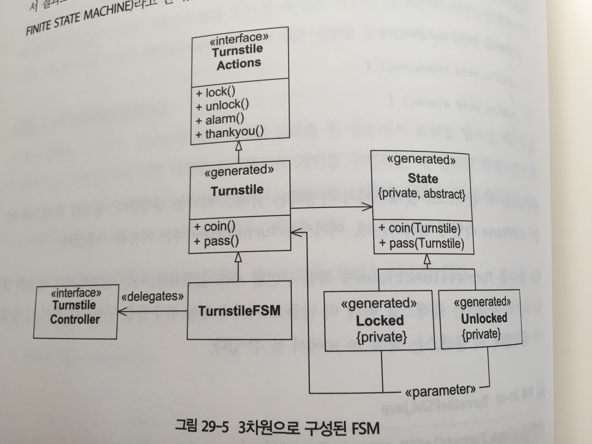
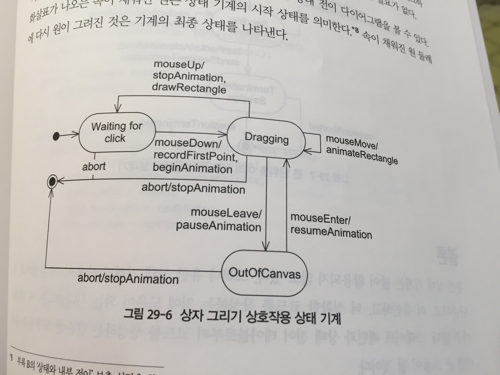
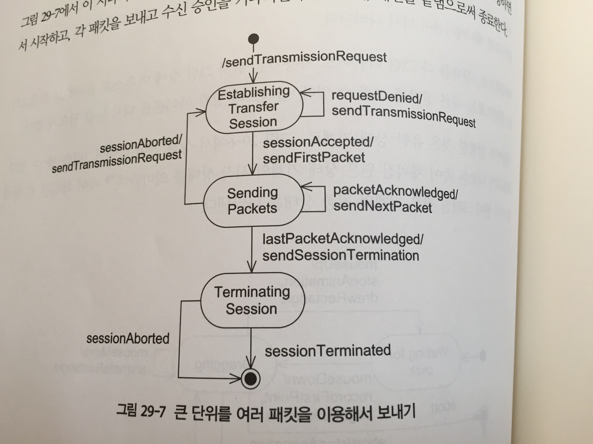

유한 상태 오토마타는 복잡한 시스템의 행위를 조사하거나 정의 할 수 있는 간결하면서도 명쾌한 방법을 제공한다.

## 유한 상태 오토마타의 개괄

- 지하철 개찰구가 작동하는 방식에서 간단한 `유한 상태 기계(FSM: finite state machine)`의 한 예를 찾아낼 수 있다.

```
Locked -- coin/unlock --> Unlocked
Unlocked -- pass/lock --> Locked
```

- 위 다이어그램은 `상태 전이 다이어그램(STD: state transition diagram)`이라 한다.
  - STD는 각 끝부분은 `상태(state)`라고 한다.
  - 상태를 연결하는 화살표는 `전이(transition)` 라고 한다.
  - 전이에는 `이벤트(event)`의 이름과 그 이벤트에 따르는 `행동(action)`이 이름표로 붙는다. 

- STD는 다음과 같이 읽을 수 있다.
  - 만약 기계가 Locked 상태에 있는데 coin 이벤트를 받는다면, Unclocked 상태로 전이 하고 unlock 행동을 호출한다.
  - 만약 기계가 Unlocked 상태에 있는데 pass 이벤트를 받는다면, Locked 상태로 전이하고 lock 행동을 호출한다.

- `상태 전이 테이블(STT: state transition table)`이라는 단순한 표로 요약할 수도 있다. 

| 상태      | 이벤트 | 상태      | 행동    |
|----------|------|----------|--------|
| Locked   | coin | Unlocked | unlock |
| Unlocked | pass | Locked   | lock   |

- Locked 상태에 있는데 coin 이벤트를 받으면, Unlocked 상태로 전이하고 unlock 행동을 호출하라고 되어있다.
- 승객이 문을 통과하면 소프트웨어가 pass 이벤트를 감지하게 된다. 두번째 전이가 호출되어 기계가 Locked 상태로 다시 돌아가고 lock 함수를 호출하게 만든다.
- STD와 STT 둘다 매우 강력한 설계 도구이며 설계자가 이상한 조건 또는 그 조건을 다룰 행위의 정의되는 않은 조건을 찾아내기 쉬워진다는 것이 이들 장점 중 하나다.

위 FSM은 심각한 논리적 결함이며 다음과 같이 고칠 수 있다.

```
Locked -- pass/alarm --> Locked
Locked -- coin/unlock --> Unlocked
Unlocked -- pass/lock --> Locked
Unlocked -- coin/thankyou --> Unlocked
```

- Unlocked 상태에서 승객이 동전을 넣으면 더 넣도록 부추깁니다.
- Locked 상태에서 잠긴 문을 통과한다면 FSM은 계속 Locked 상태에서 머무르면서 경고음을 울린다.

## 구현기법

### 중첩된 switch/case 문

- 첫번째 전략은 중첩된 switch/case 문을 사용하는 것이다.

```java
public class Turnstile {
  // States
  public static final int LOCKED = 0;
  public static final int UNLOCKED = 1;

  // Events
  public static final int COIN = 0;
  public static final int PASS = 1;

  /* private */ int state = LOCKED;

  private TurnstileController turnstileController;

  public Turnstile(TurnstileController action) {
    turnstyleController = action;
  }

  public void event(int event) {
    switch (state) {
      case LOCKED:
        switch (event) {
        case COIN:
          state = UNLOCKED;
          turnstileController.unlock();
          break;
        case PASS:
          turnstileController.alarm();
          break;
        }
        break;
      case UNLOCKED:
        switch (event) {
        case COIN:
          turnstileController.thankyou();
          break;
        case PASS:
          state = LOCKED;
          turnstileController.lock();
          break;
        }
        break;
    }
  }
}
```

- 영역마다 필요하면 상태를 변경하고 적절한 행동을 호출한다.
  - Locked 영역의 Coin 이벤트 부분에서는 상태를 Unlocked으로 변경하고 unclock을 호춣한다.

중첩된 switch/case 의 흥미로운 부분을 발견하기 위해 테스트 케이스를 보자.

```java
public interface TurnstileController {
  public void lock();
  public void unlock();
  public void thankyou();
  public void alarm();
}
```

```java
public class TestTurnstile extends TestCase {
  public static void main(String[] args) {
    TestRunner.main(new String[]{"TestTurnstyle"});
  }

  public TestTurnstile(String name) {
    super(name);
  }

  private Turnstile t;
  private boolean lockCalled = false;
  private boolean unlockCalled = false;
  private boolean thankyouCalled = false;
  private boolean alarmCalled = false;


  public void setUp() {
    TurnstileController controllerSpoof = new TurnstileController()
    {
      public void lock() {lockCalled = true;}
      public void unlock() {unlockCalled = true;}
      public void thankyou() {thankyouCalled = true;}
      public void alarm() {alarmCalled = true;}
    };

    t = new Turnstile(controllerSpoof);
  }

  public void testInitialConditions() {
    assertEquals(Turnstile.LOCKED, t.state);
  }

  public void testCoinInLockedState() {
    t.state = Turnstile.LOCKED;
    t.event(Turnstile.COIN);
    assertEquals(Turnstile.UNLOCKED, t.state);
    assert(unlockCalled);
  }

  public void testCoinInUnlockedState() {
    t.state = Turnstile.UNLOCKED;
    t.event(Turnstile.COIN);
    assertEquals(Turnstile.UNLOCKED, t.state);
    assert(thankyouCalled);
  }

  public void testPassInLockedState() {
    t.state = Turnstile.LOCKED;
    t.event(Turnstile.PASS);
    assertEquals(Turnstile.LOCKED, t.state);
    assert(alarmCalled);
  }

  public void testPassInUnlockedState() {
    t.state = Turnstile.UNLOCKED;
    t.event(Turnstile.PASS);
    assertEquals(Turnstile.LOCKED, t.state);
    assert(lockCalled);
  }
}
```

#### 범위가 패키지인 상태 변수

- 위 테스트에서는 state 변수에 접근을 하는데 이는 private로 할 수 가 없다는것을 의미한다.
- 클래스의 모든 인스턴스 변수는 private 이어야 한다는 것이 객체 지향의 정설이다. Turnstile의 캡슐화를 깨버렸다.

#### 행동을 테스트하기

- 테스트를할 생각을 하지 않고 그냥 상태 기계를 작성했다면 아마도 TurnstileController 인터페이스를 만들지 않았을 것이다.
- TurnstileController 인터페이스는 유한 상태 기계의 논리와 이 기계가 해야 할 행동 사이의 결합을 깔끔하게 끊어 놓는다.
- 각 단위를 독립적으로 검증하는 테스트 코드를 만들어야 한다는 필요성 때문에, 우리는 테스트할 필요가 없었더라면 사용하지 않았을 방법들로 코드 사이의 결합을 끊게 된다.
- 테스트 용이성은 결합이 더 적게 나타나는 상태로 설계를 이끄는 힘으로서 작용한다.

#### 중첩된 switch/case 구현의 비용과 장점

- FSM 의 규모가 크다면 코드를 알아보기가 힘들어진다.
- 읽고 있는 상태 기계에서 어디를 봐야 하는지 찾는 데 도움이 되는 편리한 표식도 없다.
- 길이가 긴 중첩된 switch/case 문을 유지보수하는 일은 매우 어렵고, 실수에 취약한 작업이 되기 쉽다.
- 유한 상태의 기계의 논리와 행동을 구현하는 코드 사이의 구별이 명확하지 않다는 점이 중첩된 switch/case의 또 다른 비용이다.

### 전이 테이블 해석

- 전이를 설명하는 데이터 테이블을 만드는 것도 FSM 을 구현하는 매우 흔항 방법이다.
- 이벤트를 처리하는 일종의 엔진이 이 테이블을 해석하는데, 엔진은 발생한 이벤트와 들어맞는 전이를 찾아서 적절한 동작을 호출하고 상태를 변경한다.

```java
// 개찰구 전이 테이블 구축하기
private class Transition {
  public Transition(int currentState, int event, int newState, Action action) {
    this.currentState = currentState;
    this.event = event;
    this.newState = newState;
    this.action = action;
  }

  int currentState;
  int event;
  int newState;
  Action action;
}

public Turnstile(TurnstyleController action) {
  turnstyleController = action;
  addTransition(LOCKED,   COIN, UNLOCKED, unlock()  );
  addTransition(LOCKED,   PASS, LOCKED,   alarm()   );
  addTransition(UNLOCKED, COIN, UNLOCKED, thankyou());
  addTransition(UNLOCKED, PASS, LOCKED,   lock()    );
}

private void addTransition(int currentState, int event, int newState, Action action) {
  transitions.add(new Transition(currentState, event, newState, action));
}
```

```java
// 전이 엔진
public void event(int event) {
  for (int i = 0; i < transitions.size(); i++) {
    Transition transition = (Transition) transitions.elementAt(i);
    if (state == transition.currentState && event == transition.event) {
      state = transition.newState;
      transition.action.execute();
    }
  }
}
```

#### 전이 테이블을 해석하는 접근 방법의 비용과 장점

- 전이 테이블을 구착하는 코드를 정규적인 상태 전이 테이블처럼 읽을 수 있다는 점이 이 방법의 굉장히 강력한 장점이다.
- addTransaction 네 라인을 이해하기는 굉장히 쉽다. 상태 기계의 논리도 한 장소에 모여 있으며, 동작의 구현과 섞여 오염되지도 않는다.
- 실행 시간에 테이블을 쉽게 교체할 수 있다는 점이 이 접근 방법의 또 다른 장점이다. 상태 기계의 로직을 동적으로 교체할 수 있다.
- 각기 다른 FSM 논리를 나타내는 여러 테이블을 생성할 수 있다는 것도 또 다른 장점이다. 시작 조건에 따라 이 테이블들을 실행 시간에 선택할 수 있게 된다.
- 이 패턴의 주된 비용은 속도다 테이블을 검색하려면 시간이 걸린다. 커다란 상태 기계라면 이 시간이 무시 못 할 정도로 오래 걸릴 수도 있다.
- 테이블을 지원하기 위해 작성해야 하는 코드의 양도 또 다른 비용으로 작용한다. 상태 전이 테이블을 간결하게 표현할 수 있게 만드는 것이 목적인 작은 지원 함수들을 상당히 많이 볼 수 있다.

## 스테이트 패턴

- 스테이트 패턴도 유한 상태 기계를 구현하기 위한 또 다른 기법이다.
- 스테이트 패턴은 중첩된 switch/case 문의 효율성과 상태 테이블을 해석하는 기법의 유연성을 결합한 패턴이다.

- Turnsstile 클래스는 이벤트들을 공용 메소드로 갖고 있고 행동들은 보호(protected) 메서드로 갖고 있다.
- 이 클래스에는 TurnstileState라는 인터페이스에 대한 참조도 하나 있다. TurnstileState의 팡생형 2개가 각각 FSM의 상태 2개를 나타낸다.

```uml
TurnstileState <|-- TurnstileLockedState
TurnstileState <|-- TurnstileUnlockedState

Turnstile <-- TurnstileState
Turnstile <.. TurnstileLockedState
Turnstile <.. TurnstileUnlockedState
```

- Turnstile 의 이벤트 메소드 2개 중 하나가 호출되면, Turnstile은 이 이벤트를 TurnstileState 객체에게 위임한다.
- TurnstileLockedState 의 메소드들은 LOCKED 상태에서 이 ㅂ이벤트를 받으면 수행할 행동을 구현한다.
- TurnstileUnlockedState 의 메소드들은 UNLOCKED 상태에서 이 이벤트를 받으면 수행할 행동을 구현한다.
- Turnstile 객체에 있는 참조가 이 파생형 가운데 하나의 인스턴스를 가리키게 하면 된다.

```java
interface TurnstileState {
  void coin(Turnstyle t);
  void pass(Turnstyle t);
}

class LockedTurnstileState implements TurnstileState {
  public void coin(Turnstyle t) {
    t.setUnlocked();
    t.unlock();
  }

  public void pass(Turnstyle t) {
    t.alarm();
  }
}

class UnlockedTurnstileState implements TurnstileState {
  public void coin(Turnstyle t) {
    t.thankyou();
  }

  public void pass(Turnstyle t) {
    t.setLocked();
    t.lock();
  }
}
```

- LockedTurnstileState 의 coin 메소드는 Turnstile 객체에게 상태를 Unlocked로 바꾸라고 말한 다음, Turnstile의 unlock 행동 함수를 호출한다.

```java
public class Turnstile {
  private static TurnstileState lockedState = new LockedTurnstyleState();
  private static TurnstileState unlockedState = new UnlockedTurnstyleState();

  private TurnstileController turnstileController;
  private TurnstileState state = lockedState;

  public Turnstyle(TurnstileController action) {
    turnstyleController = action;
  }

  public void coin() {
    state.coin(this);
  }

  public void pass() {
    state.pass(this);
  }

  public void setLocked() {
    state = lockedState;
  }

  public void setUnlocked() {
    state = unlockedState;
  }

  public boolean isLocked() {
    return state == lockedState;
  }

  public boolean isUnlocked() {
    return state == unlockedState;
  }

  void thankyou() {
    turnstileController.thankyou();
  }

  void alarm() {
    turnstileController.alarm();
  }

  void lock() {
    turnstileController.lock();
  }

  void unlock() {
    turnstileController.unlock();
  }
}
```

- TurnstileState의 파생형들이 정적 변수에 담겨있음을 눈여겨 보자.
- 이 두 클래스는 변수가 없으므로 인스턴스를 하나 이상 만들 필요가 없다.
- TurnstileState 파생형의 인스턴스들을 변수로 가지고 있으면 상태가 변경될 때마다 새로운 인스턴스를 만들지 않아도 된다.
- 변수를 정적으로 만들면 Turnstile의 인스턴스가 2개 이상 필요할 경우에도 파생형들의 새로운 인스턴스를 만들지 않아도 된다.

#### 스테이트와 스트래터지

- 두 패턴 모두 컨텍스트 클래스가 있으며, 두 패턴 모두 파생형이 여러개 있는 다형적인 기반 클래스에게 위임한다.
- 스테이트에서는 파생형이 컨텍스트 클래스에 대한 참조를 갖고 있다는 점이 두 패턴 사이의 차이점이다. 이 참조를 통해 컨텍스트 클래스의 어떤 메소드를 부를지 선택해서 호출하는 것이 스테이트에서 파생형의 중심 기능이다.
- 스트래터지 패턴의 파생형은 컨텍스트의 참조를 꼭 갖고 있을 필요도 없으며, 컨텍스트의 메소드를 반드시 불러야 할 필요도 없다.

#### 스테이트 패턴의 비용과 장점

- 행동은 Context 클래스에서 구현하게 되고, 논리는 State 클래스의 파생형들 사이에 분산된다. 이렇게 하면 다른 쪽에 영향을 주지 않고도 한쪽을 변경하는 일이 매우 쉬워진다.
- 스테이트 패턴을 사용하면 테이블 주도적 접근 방법의 유연성과 중첩된 switch/case 접근 방법의 효율성을 동시에 가질 수 있다.
- 이 기법의 비용은 갑절이 든다. 상태가 20개인 상태 기계를 작성하는 작업을 하다 보면 정신이 멍해진다.
- 논리가 분산된다. 상태 기계의 논리를 모두 볼 수 있는 장소가 없으며, 코드를 유지보수하기 힘들어진다.

### 상태 기계 컴파일러(SMC)

- 상태 파생형을 작성하는 지루함과 상태 기계의 논리를 한 장소에서 표현할 필요성 때문에 저자는 텍스트로 작성된 상태 전이 테이블을 스테이트 패턴을 구현하는데 필요한 클래스들로 변환하는 상태 기계 컴파일러(SMC: State Machine Compiler)를 만들게 되었다.

```sm
FSMName Turnstyle
Context TurnstyleActions
Initial Locked
Exception FSMError {
    Locked {
        coin    Unlocked    unlock
        pass    Locked      alarm
    }
    Unlocked {
        coin    Unlocked    thankyou
        pass    Locked      lock
    }
}
```

- 맨 위의 네줄은 각각 상태 기계의 이름, 컨텍스트 클래스의 이름, 시작상태, 잘못된 이벤트를 받았을 때 던질 예외의 이름이다.
- 이 컴파일러를 사용하려면, 행동 함수들을 선언하는 클래스도 하나 만들어야 한다.
- 컴파일러는 TurnstileActions 을 파생하는 클래스 하나를 생성한다. 여기서는 Trunstile이라는 이름을 사용한다.

```java
public abstract class TurnstileActions {
  public void lock() {}
  public void unlock() {}
  public void thankyou() {}
  public void alarm() {}
}
```

- 컴파일러가 생성한 클래스로부터 파생받는 클래스를 하나 더 만들고 거기에 행동함수들을 구현한다.

```java
public class TurnstileFSM  extends Turnstile {
  private TurnstileController controller;
  public TurnstyleFSM(TurnstileController controller) {
    this.controller = controller;
  }

  public void lock() {
    controller.lock();
  }

  public void unlock() {
    controller.unlock();
  }

  public void thankyou() {
    controller.thankyou();
  }

  public void alarm() {
    controller.alarm();
  }
}
```

- 나머지는 모두 SMC 가 생성해 준다.



- 자동으로 생성된 코드를 직접 변경해야 할 일은 절대로 없어야 한다. 심지어 그 코드를 보는 일도 없어야 한다.

#### 스테이트 패턴에 SMC 접근 방법을 사용할 때의 비용과 장점

- 유한 상태 기계에 대한 설명은 한 장소에 모두 모여 있고, 따라서 유지보수하기도 매우 쉽다.
- 유한 상태 기계의 논리와 행동의 구현이 철저이 분리되어 있으므로, 다른 쪽에 영향을 주지 않고 한쪽을 바꿀 수 있다.

## GUI에 대한 상위 수준의 애플리케이션 정책

```sm
Initial init {
  init {
    start logginIn displayLoginScreen
    // start 이벤트가 발동되면 logginIn 상태가 되고 displayLoginScreen 액션이 호출된다.
  }
  
  logginIn {
    enter checkingPassword checkPassword
    cancel init clearScreen
  }

  checkingPassword {
    passwordGood loggedIn startUserProcess
    passwordBad notifyingPasswordBad displayBoadPasswordScreen
    thirdBadPassword screenLocked displayLockScreen
  }

  notifyingPasswordBad {
    OK checkingPassword displayLoginScreen
    cancel init clearScreen
  }

  screenLocked {
    enter checkingAdminPassword checkAdminPassword
  }

  checkingAdminPassword {
    passwordGood init clearScreen
    passwordBoad screenLocked displayLockScreen
  }
}
```

- 여기서는 애플리케이션의 상위 수준 정책을 상태 기계에 담는 것이였다.
- 시스템의 나머지 코드도 정책 코드와 섞이지 않기 때문에 굉장히 단순해진다.

### GUI 상호작용 컨트롤러

- 사용자가 화면에 상자를 그릴 수 있게 하고 싶다고 해보자. 사용자가 수행하는 동작은 다음과 같다.



- 화살표가 나오는 속이 채워진 원은 상태 기계의 시작 상태르르 의미한다.
- 속이 채워진 원 둘레에서 다시 원이 그려진 것은 기계의 최종 상태를 나타낸다.

### 분산처리

- 분산처리도 들어오는 이벤트에 기반해서 시스템의 상태가 변경되는 또 다른 상황이다.
- 네트워크의 한 노드에서 다른 노드로 커다란 정보 단위를 전달해야 한다고 생각해보자. 이때 네트워크 응답시간이 매우 중요하므로 이 단위 하나를 패킷 여러 개로 쪼개서 보내야 한다고도 생각해보자.



## 결론

- 스테이트 패턴과 상태 전이 테이블로부터 코드를 생성하는 단순한 도구들을 활용하면 큰 도움이 될 것이다.
