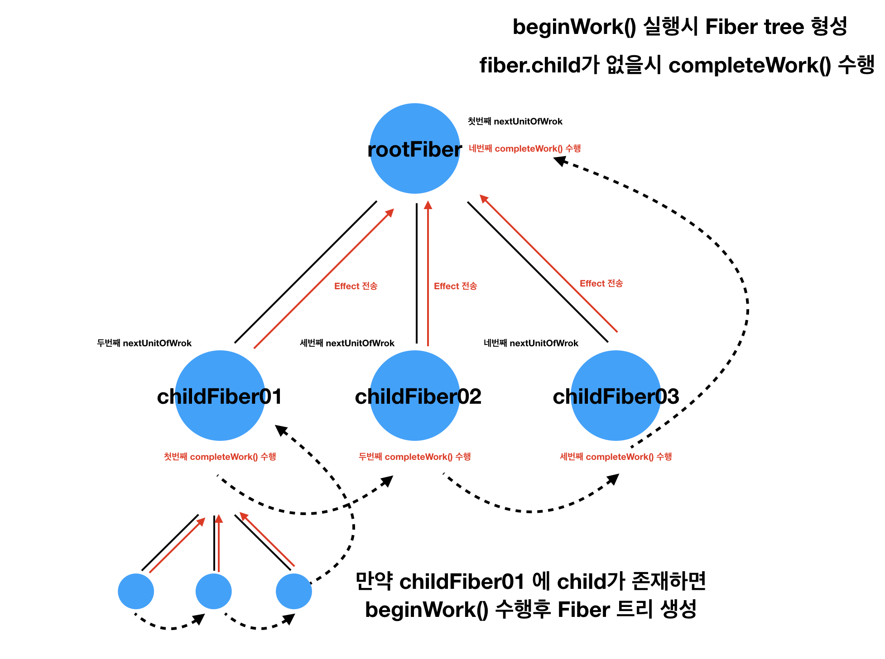

이 글은 아래 링크에 있는 글을 참조 했습니다.
[참조](https://engineering.hexacta.com/didact-learning-how-react-works-by-building-it-from-scratch-51007984e5c5)

## Rendering DOM element

우리가 render 할 때 필요한게 뭔지 설명하기 위해 plain JS object 를 하나 만들 것입니다.
이것을 우리는 element 라고 부를 것입니다. 여기서는 `type` 과 `props`라는 2 개의 프로퍼티가 요구됩니다.
`type`은 기본 string 또는 function 이 될 수 있고, props 는 비어있을 수 있는 객체가 될것입니다. null 은 오지 않습니다. 여기서 props 는 children 이라는 프로퍼티도 가질 것입니다. children 은 배열로 구성될 것입니다.

예를 들면 아래와 같습니다.

```javascript
const element = {
  type: 'div',
  props: {
    id: 'container',
    children: [
      { type: 'input', props: { value: 'foo', type: 'text' } },
      { type: 'a', props: { href: '/bar' } },
      { type: 'span', props: {} },
    ],
  },
}
```

위 객체는 아래 dom 을 설명하는 것이 됩니다.

```html
<div id="container">
  <input value="foo" type="text">
  <a href="/bar"></a>
  <span></span>
</div>
```

DOM Element 를 그려봅시다.

다음 단계는 element 와 그 element 의 children 을 dom 에 그리는 일입니다. 여기서 우리는 element 와 dom container 를 받는 `render` 함수 (`ReactDom.render`와 같은 )를 이용할 것입니다. 이 함수는 element 에 정의된 dom sub-tree 를 생성하고 container 에 그것을 추가할 것입니다.

```javascript
function render(element, parentDom) {
  const { type, props } = element
  const dom = document.createElement(type)
  const childElement = props.children || []

  childElement.forEach(childElement => render(childElement, dom))
  parentDom.appendChild(dom)
}

render(element, document.getElementById('root'))
```

`render`함수는 root Dom 에 실제 element 를 실제 Dom 객체로 바꿔서 append 시킨다.
위에서 빠뜨린 부분이 있다면 프로퍼티들과 이벤트 리스너이다. `props` 프로퍼티 이름들을 `Object.keys` 를 이용해서 순회하고 알맞게 셋팅해보자.

```javascript
function render(element, parentDom) {
  const { type, props } = element
  const dom = document.createElement(type)

  // props setting start
  const isListener = name => name.startWith('on')
  Object.keys(props)
    .filter(isListener)
    .forEach(name => {
      const eventType = name.toLowerCase().substring(2)
      dom.addEventListener(eventType, props[name])
    })

  const isAttribute = name => !isListener(name) && name != 'children'
  Object.keys(props)
    .filter(isAttribute)
    .forEach(name => {
      dom[name] = props[name]
    })

  // end

  const childElement = props.children || []
  childElement.forEach(childElement => render(childElement, dom))
  parentDom.appendChild(dom)
}
```

다음은 DOM 의 Text Nodes 를 render 하는 방법이다.
여기서 Text Node 를 표현하는 방법은 children 배열에 element 객체가 아닌 plain text 가 들어간 경우가 될 것입니다.
이전 까지는 children 에 element 객체를 품은 배열이였습니다.

```javascript
const reactElement = {
  type: 'span',
  props: {
    children: ['Foo'],
  },
}
```

하지만 여기서 children 배열에 type 과 props 가 들어간 객체만 온다는 룰을 가지고 있으면 우린 더 적은 if 문을 만들 수 있을 것이다. 해서 text 타입은 "TEXT ELEMENT" 라고 props 에는 nodeValue 라는 프로퍼티를 갖게 만들어 봅시다.

```javascript
const textElement = {
  type: 'span',
  props: {
    children: [
      {
        type: 'TEXT_ELEMENT',
        props: { nodeValue: 'Foo' },
      },
    ],
  },
}
```

여기서 우리가 정의한 text element 대로 render 하는 함수를 다시 수정해보자. 여기서 달라지는 점이 있다면 일반 dom type 일 경우에는 `createElement` 의 dom api 를 썼을텐데 text 는 `createTextNode` 라는 dom api 를 사용하자.

```javascript
function render(element, parentDom) {
  const { type, props } = element

  // Create DOM element
  const isTextElement = type === 'TEXT ELEMENT'
  // 타입에 따라 다른 api를 사용한다.
  const dom = isTextElement
    ? document.createTextNode('')
    : document.createElement(type)

  // Add event listeners
  const isListener = name => name.startsWith('on')
  Object.keys(props)
    .filter(isListener)
    .forEach(name => {
      const eventType = name.toLowerCase().substring(2)
      dom.addEventListener(eventType, props[name])
    })

  // Set properties
  // 여기서 nodeValue도 셋팅한다.
  const isAttribute = name => !isListener(name) && name !== 'children'
  Object.keys(props)
    .filter(isAttribute)
    .forEach(name => {
      dom[name] = props[name]
    })

  // Render children
  const childElements = props.children || []
  childElements.forEach(childElement => render(childElement, dom))

  // Append to parent
  parentDom.appendChild(dom)
}
```

## Element creation and JSX

```javascript
const element = {
  type: 'div',
  props: {
    id: 'container',
    children: [
      { type: 'input', props: { value: 'foo', type: 'text' } },
      {
        type: 'a',
        props: {
          href: '/bar',
          children: [{ type: 'TEXT ELEMENT', props: { nodeValue: 'bar' } }],
        },
      },
      {
        type: 'span',
        props: {
          onClick: e => alert('Hi'),
          children: [
            { type: 'TEXT ELEMENT', props: { nodeValue: 'click me' } },
          ],
        },
      },
    ],
  },
}
```

위 Element 를 좀 더 쉽게 만들기 위해 JSX 를 사용하면 쉽게 읽히면서도 쉽게 표현이 된다. 여기서 JSX 는 우리가 DOM 에 무엇을 표현하고 싶은지를 설명해주는 한 방법이다.

바벨을 사용한다면 JSX 표현은 다음과 같이 변경된다.

```javascript
const element = (
  <div id="container">
    <input value="foo" type="text" />
    <a href="/bar">bar</a>
    <span onClick={e => alert('Hi')}>click me</span>
  </div>
)
```

[try it on babel REPL](https://babeljs.io/repl/#?babili=false&evaluate=true&lineWrap=false&presets=react&targets=&browsers=&builtIns=false&debug=false&code=%2F**%20%40jsx%20createElement%20*%2F%0A%0Aconst%20element%20%3D%20%28%0A%20%20%3Cdiv%20id%3D%22container%22%3E%0A%20%20%20%20%3Cinput%20value%3D%22foo%22%20type%3D%22text%22%20%2F%3E%0A%20%20%20%20%3Ca%20href%3D%22%2Fbar%22%3Ebar%3C%2Fa%3E%0A%20%20%20%20%3Cspan%20onClick%3D%7Be%20%3D%3E%20alert%28%22Hi%22%29%7D%3Eclick%20me%3C%2Fspan%3E%0A%20%20%3C%2Fdiv%3E%0A%29%3B)

```javascript
const element = createElement(
  'div',
  { id: 'container' },
  createElement('input', { value: 'foo', type: 'text' }),
  createElement('a', { href: '/bar' }, 'bar'),
  createElement('span', { onClick: e => alert('Hi') }, 'click me')
)
```

그래서 우린 `createElement` 함수를 만들어 줄 것이다. 첫번째 인자는 `type` 인자이고 두번째 인자는 `props` 이다. 그리고 나머지 인자들은 `children` 이다.
`createElement` 함수는 `props` 객체를 만들어주고 두번째 인자의 값들을 전부 할당해 주어야 한다. 또, `children` 프로퍼티는 두번째 이후로 오는 인자들을(...args) 배열로 만들어서 `props` 의 `children` 프로퍼티에 셋팅해준다. 그리고 type 과 props 를 반환하면 된다.

```javascript
function createElement(type, props, ...args) {
  const props = Object.assign({}, config)
  const hasChildren = args.length > 0
  props.children = hasChildren ? [].concat(...args) : []
  return { type, props }
}
```

위 createElement 함수에서 text node 에 해당하는게 하나 빠져있다. 위 함수대로 작동을 한다면 아래 span 의 text node 의 경우에 그냥 string 값이 들어갈 것이다.

아까 우린 위에서 text node 도 `{ type: TEXT_ELEMENT, props: {nodeValue: 'test'}}` 로 만들어 주기로 했었다. 해서 createElement 를 수정해야 한다.

```javascript
const spanElement = createElement(
  'span',
  { onClick: e => alert('Hi') },
  'click me'
)

spanElement = {
  type: 'span',
  props: {
    onClick: e => alert('Hi'),
    children: ['click me'], // [{type: TEXT_ELEMTN, props: {nodeValue: 'click me'}}]
  },
}
```

수정해 보자.

```javascript
const TEXT_ELEMENT = 'TEXT ELEMENT'

function createElement(type, config, ...args) {
  const props = Object.assign({}, config)
  const hasChildren = args.length > 0
  const rawChildren = hasChildren ? [].concat(...args) : []
  // children 배열을 돌면서 textElement는 TEXT ELEMENT 타입으로 변환해서 넣어준다.
  props.children = rawChildren
    .filter(c => c != null && c !== false)
    .map(c => (c instanceof Object ? c : createTextElement(c)))
  return { type, props }
}
// text element 생성
function createTextElement(value) {
  return createElement(TEXT_ELEMENT, { nodeValue: value })
}
```

## Instances, reconciliation and virtual DOM

지금까지는 JSX 설명을 기반으로 dom 요소를 만드는 메커니즘을 구현했습니다. 이번에는 DOM 을 어떻게 업데이트 시키는지에 대해서 포커스를 둘 것입니다.
우선 setState 를 설명하기 전까지 dom update 를 할수 있는 방법은 달라진 element 를 가지고 render 함수를 반복해서 시키는 방법입니다.

```javascript
const rootDom = document.getElementById('root')

function tick() {
  const time = new Date().toLocaleTimeString()
  const clockElement = <h1>{time}</h1>
  render(clockElement, rootDom)
}

tick()
setInterval(tick, 1000)
```

[codepen](https://codepen.io/pomber/pen/KmXeXr?editors=0010)

위에서 계속 바왔던 `render` 함수는 container 에 element 를 넘기면 element 를 dom 으로 만들어서 container 에 append 시키는 함수이다. element 의 children 도 `render` 재귀로 돌면서 실행하게 된다.

기존 `render` 는 매 `tick`할 시에 같은 div 를 업데이트하는 대신에 새로운 것을 추가하는 방식이라서 update 에 적합하지가 않다.
그래서 처음으로 바꿔야 할 부분은 각 업데이트에 대해 dom 을 replace 하는 작업이고, render 함수 마지막 부분에 우리는 parent 에 어떤 child 가 있다면 그것을 새롭게 element 로 만들어진 dom 으로 교체 되도록 한다.

```javascript
function render(element, parentDom) {
  // ...
  // Create dom from element
  // ...

  // Append or replace dom
  // lastChild는 노드의 마지막 자식을 반환합니다.
  if (!parentDom.lastChild) {
    parentDom.appendChild(dom)
  } else {
    // replaceChild(newChild, oldChild);
    parentDom.replaceChild(dom, parentDom.lastChild)
  }
}
```

[codepen](https://codepen.io/pomber/pen/eWGQRz?editors=0010)

첫번째 render 시에 h1 에 TEXT_ELEMENT 를 먼저 append 하고 h1 을 root 컨테이너 dom 에 append 합니다.
두번째 부터는 render 시에는 똑같이 h1 에 TEXT_ELEMENT 를 먼저 append 하고 만들어진 h1 을 root 컨테이너에 append 하기 전에 root 컨테이너에 lastchild 가 있다면 parentDom.lastchild 를 dom 으로 replace 한다.

**여기서 문제점은 update 상황에서 render 시에 모든 children 을 재 생성해서 마지막 root container dom 에만 replace 한다는 점이다. render 에서 모든 element 타입에 대해서 새로 만들기 때문에 자식들의 부모의 lastChild 는 null 이 되어 appendChild 가 실행될 것이다. 그 상황에서 기존에 그려놨던 root 의 경우에는 이미 한번 그려져 있는게 있기 때문에 replace 로직으로 처리가 된다.**

이런 작은 상황에서는 잘 동작하지만 좀 더 복잡한 케이스에서는 모든 child node 들을 재 생성 하는 퍼포먼스 비용이 만족스럽지 않습니다.
그래서 우린 현재 **새로 생성한 elements tree 와 이전 render 를 호출했을 때 사용되었던 element tree 를 비교**해서 달라진 곳만 update 시켜야 한다.

### Virtual DOM and Reconciliation

React 에서는 위에서 말한 달라진 곳을 비교하는 이 "diffing" 프로세싱을 **reconciliation** 이라 부릅니다. 우리도 이와같이 하기 위해서 **이전 render 에 사용 되었던 element tree 구조를 보관할 필요가 있고 이것을 새로운 element tree 구조와 비교할 것입니다. 다른말로 하면 우리의 virtual DOM 버젼을 계속 유지해 나갈 것이다.**

virtual DOM 안에 있는 "노드들"은 무엇을 해야 할까요? 한가지 옵션으로 단지 Elements 로 사용을 하는 것입니다. 이 Elements 들은 `props.children` 프로퍼티를 이미 가지고 있다. 이 프로퍼티는 tree 구조 처럼 element 들 탐색을 가능하게 합니다. 하지만 여기서 2 가지 문제점이 있는데, 하나는 reconciliation 을 좀 더 쉽게 진행하기 위해서 각 노드의 virtual DOM 에 실제 dom 을 참조하고 있어야 한다는 점이고, element 들을 immutable 하게 유지해야 한다. 두번째 문제는 우리는 나중에 본인만의 state 를 갖고 있는 Components 를 지원할 것이고 element 들이 그것을 다루지 못하게 해야한다.

### Instances

그래서 우리는 새로운 용어인 Instances 를 소개할 것입니다. **instance 는 DOM 에 렌더링 된 element 를 나타냅니다.** 또한 element, dom, 그리고 childInstances 의 프로퍼티들을 지닌 plain 객체 입니다. childInstances 는 children element 의 instancese 들을 지닌 배열입니다.

각 DOM 노드는 매칭된 instance 를 가지고 있을 것입니다. reconciliation 알고리즘의 한가지 목표는 가능한한 많이 instance 를 creating 또는 removing 을 피하는 것입니다.
여기서 instance 를 creating 그리고 removing 한다는 것은 DOM tree 를 수정해야 한다는 의미 일 것입니다.
instance 를 재사용할수록 DOM 트리를 수정하는 횟수가 줄어 듭니다.

### Refactoring

여기서 우리 render 함수를 reconciliation 알고리즘을 적용해보고, element 를 주어지면 instance 를 생성하는 instantiate 함수를 추가해보자.

```javascript
let rootInstance = null

function render(element, container) {
  const prevInstance = rootInstance
  const nextInstance = reconcile(container, prevInstance, element)
  rootInstance = nextInstance
}

// reconcile ( 조정하다, 조화시키다, 일치시키다. )
function reconcile(parentDom, instance, element) {
  // 인자값 : 부모 real DOM, 이전 instance , 새로운 element
  // 이전에 그려진 instance가 없다면 append
  // 그려진 instance가 있다면 replace 작업을 한다.
  if (instance == null) {
    // 초기 render 시
    const newInstance = instantiate(element)
    parentDom.appendChild(newInstance.dom)
    return newInstance
  } else {
    // update render 시
    const newInstance = instantiate(element)
    parentDom.replaceChild(newInstance.dom, instance.dom)
    return newInstance
  }
}

// element를 받아서 트리구조를 돌면서 instance 구조 {dom, element, childInstances}를 만든다.
function instantiate(element) {
  const { type, props } = element

  // Create DOM element
  const isTextElement = type === 'TEXT ELEMENT'
  const dom = isTextElement
    ? document.createTextNode('')
    : document.createElement(type)

  // Add event listeners
  const isListener = name => name.startsWith('on')
  Object.keys(props)
    .filter(isListener)
    .forEach(name => {
      const eventType = name.toLowerCase().substring(2)
      dom.addEventListener(eventType, props[name])
    })

  // Set properties
  const isAttribute = name => !isListener(name) && name != 'children'
  Object.keys(props)
    .filter(isAttribute)
    .forEach(name => {
      dom[name] = props[name]
    })

  // Instantiate and append children
  const childElements = props.children || []
  const childInstances = childElements.map(instantiate)
  const childDoms = childInstances.map(childInstance => childInstance.dom)
  childDoms.forEach(childDom => dom.appendChild(childDom))

  const instance = { dom, element, childInstances }
  return instance
}
```

이전과 코드는 같지만, 여기서 다른점은 마지막으로 호출한 render 에서 나온 instance 를 저장하고 있다는점이다. 또한 reconciliation 함수를 instantiation 으로 부터 분리 했습니다.
dom nodes 를 재사용하기 위해서는, dom 프로퍼티들을 update 할 방법이 필요하다. ( className, style, onCLick, etc...) 등등의 업데이트 그래서 dom 프로퍼티를 update 하는 함수를 따로 분리해서 작성해보자.

```javascript
// element를 받아서 트리구조를 돌면서 instance 구조 {dom, element, childInstances}를 만든다.
function instantiate(element) {
  const { type, props } = element

  // Create DOM element
  const isTextElement = type === 'TEXT ELEMENT'
  const dom = isTextElement
    ? document.createTextNode('')
    : document.createElement(type)

  updateDomProperties(dom, [], props)

  // Instantiate and append children
  const childElements = props.children || []
  const childInstances = childElements.map(instantiate)
  const childDoms = childInstances.map(childInstance => childInstance.dom)
  childDoms.forEach(childDom => dom.appendChild(childDom))

  const instance = { dom, element, childInstances }
  return instance
}

// dom을 만들고 나서 dom의 프로퍼티들을 셋팅할때 사용한다.
function updateDomProperties(dom, prevProps, nextProps) {
  const isEvent = name => name.startsWith('on')
  const isAttribute = name => !isEvent(name) && name != 'children'

  // Remove event listeners
  Object.keys(prevProps)
    .filter(isEvent)
    .forEach(name => {
      const eventType = name.toLowerCase().substring(2)
      dom.removeEventListener(eventType, prevProps[name])
    })

  // Remove attributes
  Object.keys(prevProps)
    .filter(isAttribute)
    .forEach(name => {
      dom[name] = null
    })

  // Set attributes
  Object.keys(nextProps)
    .filter(isAttribute)
    .forEach(name => {
      dom[name] = nextProps[name]
    })

  // Add event listeners
  Object.keys(nextProps)
    .filter(isEvent)
    .forEach(name => {
      const eventType = name.toLowerCase().substring(2)
      dom.addEventListener(eventType, nextProps[name])
    })
}
```

`updateDomProperties` 함수는 이전 프로퍼티들을 모두 제거하고 새로운 것들을 추가한다. 이것은 프로퍼티가 변경되도 변화를 시키지 않으므로 불필요한 업데이트가 많이 발생하지만 단순하게하기 위해 지금은 그대로 두겠습니다.

### Reusing DOM nodes

reconciliation 알고리즘은 DOM nodes 를 가능하면 재 사용하는 것이라고 말했습니다. 그래서 type 이 같다면 해당 DOM node 를 재사용할 것입니다. ( 프로퍼티만 update 할것이다. )

```javascript
function reconcile(parentDom, instance, element) {
  if (instance == null) {
    // Create instance
    const newInstance = instantiate(element)
    parentDom.appendChild(newInstance.dom)
    return newInstance
  } else if (instance.element.type === element.type) {
    // Update instance
    // 여기서 instance dom은 기존에 render 되었던 이전 instance 이다.
    // 이전 instance에 Real dom을 재사용해서 프로퍼티들만 update 시켜준다.
    updateDomProperties(instance.dom, instance.element.props, element.props)
    instance.element = element
    return instance
  } else {
    // Replace instance
    const newInstance = instantiate(element)
    parentDom.replaceChild(newInstance.dom, instance.dom)
    return newInstance
  }
}
```

### Children Reconciliation

reconcile 함수에서 가장 중요한 작업을 놓쳤습니다. children 을 실행시키지 않았다는 점이다.
Children reconciliation 은 주요 기술중 하나이다. 여기서는 이전과 현재 tree 구조에서 children 을 매칭 하기 위해 key 라는 추가 프로퍼티가 요구됩니다.
여기서는 오직 같은 children 배열에서 같은 위치의 children 끼리만 비교하겠습니다. 이것이 의미하는 바는 children 순서가 달라지면 DOM nodes 를 재사용하지 못한다는 비용이 든다는 점입니다.

Children reconciliation 을 실행하기 위해선 이전 child instances 인 `instance.childInstances` 와 새로운 element 의 children `element.props.children`을 매칭시킬 것입니다. 그리곤 재귀적으로 reconcil 함수를 호출할 것입니다. 또한 reconcile 에서 리턴된 모든 instances 들을 유지해서 childInstances 를 업데이트 할 수 있습니다.

```javascript
function reconcile(parentDom, instance, element) {
  if (instance == null) {
    // Create instance
    const newInstance = instantiate(element)
    parentDom.appendChild(newInstance.dom)
    return newInstance
  } else if (instance.element.type === element.type) {
    // Update instance
    // 타입이 같을때 dom을 재사용한다.
    updateDomProperties(instance.dom, instance.element.props, element.props)
    // 그리곤 children에 대해서 reconcile을 적용한다.
    // children 은 배열이기 때문에 배열 처리를 위한 reconcileChildren 함수를 활용한다.
    instance.childInstances = reconcileChildren(instance, element)
    instance.element = element
    return instance
  } else {
    // Replace instance
    // 부모가 기존 인스턴스에서 새로운 인스턴스로 replace 한다면 그 부모 children 들도 새로 instance를 생성한다.
    const newInstance = instantiate(element)
    parentDom.replaceChild(newInstance.dom, instance.dom)
    return newInstance
  }
}

function reconcileChildren(instance, element) {
  const dom = instance.dom
  const childInstances = instance.childInstances
  const nextChildElements = element.props.children || []
  const newChildInstances = []
  const count = Math.max(childInstances.length, nextChildElements.length)
  for (let i = 0; i < count; i++) {
    const childInstance = childInstances[i] // 이미 그려져 있는 children instance들.
    const childElement = nextChildElements[i] // 새로 그려야 할 children element들
    const newChildInstance = reconcile(dom, childInstance, childElement)
    newChildInstances.push(newChildInstance)
  }
  return newChildInstances
}
```

위 코드에서 reconcile 함수 안에서 instance 를 새로 생성하는 경우 ( 맨 처음 render 가 된다거나 type 이 바뀌는 replace 의 경우) 해당 부모의 자식(children) 들도 새로이 instance 를 생성한다. 즉, 부모가 instance 가 만들어지면 그 자식들도 새롭게 instance 를 만든다. 자식이 type 이 같더라도 부모가 바뀌었기 때문에 재 사용하지 못한다. <br/>

대신에 부모 element 의 type 이 같아서 dom 을 재사용 할때는 자식들을 하나하나 reconcile 처리 해준다. 이때, 자식도 type 이 같다면 재사용 가능.

### Removing DOM nodes

만약에 `nextChildElements`가 `childInstances` 보다 length 가 더 길다면 reconcileChildren 함수는 reconcile 함수를 호출할 때 instance 를 `undifined`로 해서 호출할 것이다. 그러면 `if(instance == null)` 에 걸려서 새로운 instance 를 생성할 것이다. 반면에 반대가 된다면 어떨까?

`childInstances`가 `nextChildElements` 보다 length 가 더 길다면 reconcile 함수에서 childElement 인자를 `undefined`를 보낼 것이다. 이때 reconcile 함수에서는 `element.type` 체크시 에러가 발생하게 된다.

dom 이 제거되는걸 고려하지 않았기 때문이다. 그래서 두가지를 체크 할 것이다. 하나는 reconcile 함수에서 element 가 null 인 경우와 reconcileChildren 함수에서 newChildInstance 가 null 인 경우를 필터해줄 것이다.

```javascript
function reconcile(parentDom, instance, element) {
  if (instance == null) {
    // Create instance
    // 기존에 그려진 instance가 없는 경우 element 값이 들어왔으면 새로이 추가한다.
    const newInstance = instantiate(element)
    parentDom.appendChild(newInstance.dom)
    return newInstance
  } else if (element == null) {
    // Remove instance
    // 이전에 그려졌던 instance 가 있는데 element가 null 이라는건 새로운 수정사항이 dom을 삭제했다는 것이다.
    // 그래서 그에 매칭 되는 instance.dom 을 제거해주자.
    parentDom.removeChild(instance.dom)
    // 여기서 null 을 리턴해주기 때문에 reconcileChildren 함수에서 null을 filter 처리 한다.
    return null
  } else if (instance.element.type === element.type) {
    // Update instance
    updateDomProperties(instance.dom, instance.element.props, element.props)
    instance.childInstances = reconcileChildren(instance, element)
    instance.element = element
    return instance
  } else {
    // Replace instance
    // 이미 그려진 instance가 있고 element도 새로 들어왔는데 type이 다르다면 새로 만들어서 교체한다.
    const newInstance = instantiate(element)
    parentDom.replaceChild(newInstance.dom, instance.dom)
    return newInstance
  }
}

// 인스턴스의 childInstance가 배열이기 때문에 이 배열을 돌면서 reconcile 처리.
function reconcileChildren(instance, element) {
  const dom = instance.dom // 기존에 그려졌던 dom
  const childInstances = instance.childInstances
  const nextChildElements = element.props.children || []
  const newChildInstances = []
  const count = Math.max(childInstances.length, nextChildElements.length)
  for (let i = 0; i < count; i++) {
    const childInstance = childInstances[i]
    const childElement = nextChildElements[i]
    const newChildInstance = reconcile(dom, childInstance, childElement)
    newChildInstances.push(newChildInstance)
  }
  // reconcile 함수에서 childElement가 null인 경우에 dom이 제거됬다고 간주하고 null 을 반환할 것이다.
  return newChildInstances.filter(instance => instance != null)
}
```

[codepen](https://codepen.io/pomber/pen/WjLqYW?editors=0010)

여기까지 정리를 해보면 처음에 `element` 를 받아서 무조건 dom 을 만들고 dom tree 구조를 render 함수 내에서 구조를 잡고 진행하게 되는데 맨 처음에는 render 를 모두 진행하고 나서 `parentDom.appendChild(dom)` 를 진행했다. 이러면 발생되는 문제는 계속 root dom 화면에 동일한 구조가 추가가 된다는 점이다.

이러면 안되기 때문에 replace 를 추가 하게 된다. `parentDom.replaceChild(dom, parentDom.lastChild)` 라는 로직을 추가 하게 되는데 조건은 `parentDom.lastChild`의 유무로 판단하게 된다. 이렇게 되면 root dom 밑으로 replace 가 이뤄져서 tick 같은 app 에서 원하는 조건(동일한 자리에 update 된 화면)을 달성 할 수 있다.

여기서 또 한가지의 문제는 그리고자 하는 트리형 dom 이 원하는 자리에 replace 가 되지만, 그 dom 의 `children` 에 대해서는 계속 새롭게 그린다는 점이다. 그러니깐 통으로 새로 그려서 화면의 같은자리에 replace 하고 다시 update 가 필요할땐 통으로 dom 을 새로 만들어 다시 replace 를 한다는 점이다. 변화가 필요한 dom 만 그리지 않고 전부 다시 그리는 셈이 되므로 복잡한 UI 의 경우 비용이 많이 들게 되어있다.

그래서 update 시 dom type 이 같다면 새로 create 하는 것이 아닌 dom 의 속성(props)만 update 하고 기존의 dom 은 그대로 쓰는 `reconcile` 함수를 만들었으며, 기존 그려졌던 `element`의 type 비교와 더불어 dom 의 재사용을 위한 새로운 개념인 `instance : {dom, element, childInstances }` 라는것을 도입했다. 또한 한번 그려진 이전 `instance`는 별도로 저장을 해둔다.
여기서 reconcile 함수의 역할은 parentDom, 이전의 그려졌던 instance, 새로운 element 받아서 조건에 맞게끔 dom 에 그려준다.

그래서 reconcile 의 함수에는 다음과 같은 조건이 붙는다.

* 이전에 그려놓은 `instance` 가 없다면 새로 `instance` 를 만들고 만들어진 dom 을 append 시킨다.
* 새로 그려지는 `element` 가 null 이라면 매칭되는 `parentDom` 에서 자식들을 삭제한다.
* 이전에 그려놓은 `instance` 의 element type 과 새로 그릴려는 `element type` 이 같으면 이전에 그려 놓은 `instance` 의 dom 에 prop 만 업데이트 한다. 그리고 나서 해당 `instance` 의 `children` 을 `reconcil` 을 한다. 여기서 따로 `reconcileChildren` 함수가 존재하는 이유는 `children` 이 배열 타입이기 때문이다.
* 그 외 모든 경우에는 `parentDom` 기준으로 새롭게 `instance` 를 만들어서 replace 한다.

여기까지의 문제는 dom 을 재사용하긴 했다지만 모든 변화에 대해서 전체 dom 에 대한 render 를 진행한다는 것이다.

## Components and State

위 코드에서는 몇몇 가지 문제사항이 있었다.

* 모든 변화에 전체 virtual DOM tree 를 reconciliation 을 진행합니다.
* State 가 글로벌하게 존재합니다.
* state 가 변화 된 후 render 함수를 좀 더 명시적으로 호출해야 합니다.

Components 는 이러한 이슈를 해결하는데 도움을 줄수 있습니다.

* JSX 를 이용해 Custom tag 를 정의 할 수 있습니다.
* lifecycle 이벤트에 Hook 을 걸수 있습니다.

먼저해야 할 일은 컴포넌트가 확장 될 Component 기본 클래스를 제공하는 것입니다. 우리는 구성 요소 상태를 업데이트하는 데 사용할 `partialState`를 받는 `setState` 메서드와 props 매개 변수가있는 생성자가 필요합니다.

```javascript
class Component {
  constructor(props) {
    this.props = props
    this.state = this.state || {}
  }

  setState(partialState) {
    this.state = Object.assign({}, this.state, partialState)
  }
}
```

어플리케이션 코드에서는 이 클래스를 상속받을 것입니다. 그 후에 div 와 span 같이 `<MyComponent>` 처럼 사용할 것입니다.
여기서 중요한건 우리가 만들었던 `createElement` 수정이 필요 없습니다. element `type`으로 class 컴포넌트를 받고 `props`를 다룰것입니다.
우리는 요소가 주어진 컴포넌트 인스턴스( public instances 라고 부릅니다.) 를 생성하는 함수가 필요합니다.
여기서 `public instance` 라고 하는건 class 컴포넌트의 인스턴스입니다.

```javascript
function createPublicInstance(element, internalInstance) {
  // type이 class 일 경우
  const { type, props } = element
  const publicInstance = new type(props)
  publicInstance.__internalInstance = internalInstance
  return publicInstance
}
```

public instance 생성하는 것 외에도 internal instance(from the virtual DOM) 의 레퍼런스를 추가적으로 가지고 있기 때문에 public instance state 가 변경 되었을때 해당 인스턴스 하위트리만 (instance sub-tree) 업데이트 할 수 있어야 합니다.

```javascript
class Component {
  constructor(props) {
    this.props = props
    this.state = this.state || {}
  }

  setState(partialState) {
    this.state = Object.assign({}, this.state, partialState)
    // this.__internalInstance는 가상 DOM { dom, element, childInstance, publicInstance }
    updateInstance(this.__internalInstance)
  }
}

function updateInstance(internalInstance) {
  const parentDom = internalInstance.dom.parentNode
  const element = internalInstance.element
  // 보통은 render시에 reconcile을 진행하지만
  // setState가 있을 시에도 reconcile을 진행 할 수 있다.
  reconcile(parentDom, internalInstance, element)
}
```

`instantiate` 함수도 update 가 필요합니다. components 들은 public instace 로 생성하고 component 의 `render` 함수를 child element 를 얻기 위해 호출해준다. 그리곤 해당 element 를 다시 `instantiate` 함수로 호출해준다.

```javascript
// element를 받아서 트리구조를 돌면서 instance 구조 {dom, element, childInstances}를 만든다.
// element : {type: Component , props: { ... , children: []}}
function instantiate(element) {
  const { type, props } = element
  const isDomElement = typeof type === 'string'

  if (isDomElement) {
    // Instantiate DOM element
    const isTextElement = type === TEXT_ELEMENT
    const dom = isTextElement
      ? document.createTextNode('')
      : document.createElement(type)

    updateDomProperties(dom, [], props)

    const childElements = props.children || []
    // childElements 는 배열로 들어오기 때문에 map 돌리면서 instantiate 함수 호출해줌.
    const childInstances = childElements.map(instantiate)
    const childDoms = childInstances.map(childInstance => childInstance.dom)
    childDoms.forEach(childDom => dom.appendChild(childDom))

    const instance = { dom, element, childInstances }
    return instance
  } else {
    // element.type이 class 일 경우.
    // Instantiate component element
    const instance = {}
    const publicInstance = createPublicInstance(element, instance)
    // childElement은 배열이 아니다.
    const childElement = publicInstance.render()
    // child 인스턴스가 하나임.
    const childInstance = instantiate(childElement)
    const dom = childInstance.dom
    // instance 에 publicInstance를 넣기 위해서 Object.assign을 사용
    Object.assign(instance, { dom, element, childInstance, publicInstance })
    return instance
  }
}
```

component elements 와 dom elements 를 위한 internal instances(this.\_\_internalInstance)는 다르다. Component internal instance 들은 오직 하나의 child(render 함수에서 리턴되는) 만 가지고 있다. 그래서 internal instance 들은 dom instances 들이 가지고 있는 `childInstances` 배열 인스턴스들 대신에 `childInstance` 프로퍼티 하나를 가지고 있다. 또한, component internal instance 들은 public instance (class 컴포넌트의 인스턴스) 를 가지고 있을 필요가 있다. 그래야 render 함수가 reconciliation 하는 동안 불려질수 있기 때문이다.

한가지 놓친것이 있다면 component instance 의 reconciliation 를 다루는 것이다. 그래서 우린 reconciliation algorithm 에 한가지 케이스를 더 추가할 것이다. children reconciliation 을 다루지 않아도 되는 한가지 child 만 가지고 있는 component instance 가 주어졌을때, 우린 public instance 의 props 를 update 시키고 child 를 re-render 시켜주면 된다.

```javascript
// dom을 어떤 방식으로 그릴지를 결정하는 함수
function reconcile(parentDom, instance, element) {
  if (instance == null) {
    // Create instance
    const newInstance = instantiate(element)
    parentDom.appendChild(newInstance.dom)
    return newInstance
  } else if (element == null) {
    // Remove instance
    parentDom.removeChild(instance.dom)
    return null
  } else if (instance.element.type !== element.type) {
    // Replace instance
    const newInstance = instantiate(element)
    parentDom.replaceChild(newInstance.dom, instance.dom)
    return newInstance
  } else if (typeof element.type === 'string') {
    // Update dom instance
    updateDomProperties(instance.dom, instance.element.props, element.props)
    instance.childInstances = reconcileChildren(instance, element)
    instance.element = element
    return instance
  } else {
    //Update composite instance
    instance.publicInstance.props = element.props
    const childElement = instance.publicInstance.render()
    const oldChildInstance = instance.childInstance
    const childInstance = reconcile(parentDom, oldChildInstance, childElement)
    instance.dom = childInstance.dom
    instance.childInstance = childInstance
    instance.element = element
    return instance
  }
}
```

이게 전부이다. 이 코드를 사용해서 활용한 예제이다. : [codepen](https://codepen.io/pomber/pen/RVqBrx)

class Component 에서 setState 를 사용하면 해당 컴포넌트를 기준으로 children 에 대한 `reconcile`을 진행한다.
`reconcile`을 진행한다는 것은 이전 instance 와 새로 들어온 element 를 비교해서 어떤 방법으로 dom 을 렌더링 할지를 결정하게 되는 것이다.
`instantiate`를 실행한다는 것은 새롭게 들어온 element 가 이전 그려논거랑 완전히 달라졌을 때를 실행하게 된다.

## Fiber: Incremental reconciliation

리액트 16 버젼이 출시 되었다. 그것은 리액트의 코드 대부분을 재 작성해야 할 필요가 생긴 새로운 내부적인 아키텍쳐를 가지고 있다.
이것은 예전 아키텍처로는 개발하기 힘든 일부 기능이 선적되었음을 의미합니다. 또한 이 시리즈에서 작성한 대부분의 코드는 현재 가치가 없다는 것을 의미합니다.

이제는 16 에서 사용하는 새로운 아키텍쳐를 사용해서 다시 코드를 작성해볼 예정이다. 특히, 구조, 변수들, 함수이름들을 리액트 코드베이스로 부터 가져와서 작성할 것입니다.
여기서 우리가 건들지 않아도 되는 API 는 다음과 같습니다.

* createElemetn()
* render() (오직 DOM 을 rendering 하는 함수)
* Component ( setState() 메서드를 포함한. context 나 life cycle 은 미포함)

이제 왜 우리가 예전 코드를 다시 작성해야 하는지를 설명하겠다.

### Why Fiber

브라우저의 메인 쓰레드는 시간을 많이 쓰는 무엇인가로 인해 매우 바쁘게 움직있다고 할때, 매우 중요한 task 들은 끝날때 까지 기다려야 한다.

이런 문제를 위해서 몇가지 데모를 준비했다. [데모](https://pomber.github.io/incremental-rendering-demo/react-sync.html)에서 행서들이 도는걸 유지하기 위해서 메인 쓰레드는 매 16ms 마다 사용가능 하도록 유지 시켜주어야 한다. 만약 이 메인쓰레드가 다른 무엇인가로 blocked 당했다고 한다면 여기서 매 200ms 라고 해봅시다. 메인 쓰레드가 다시 자유로워 질때 까지 행성들이 멈춰있고 해당 프레임이 사라지는걸 확인 할 수 있을 것이다.

무엇이 메인 쓰레드 즉, 몇 에니메이션을 부드럽고 UI 응답을 유지하기 위해 예비의 마이크로 초도 둘수없게 바쁘게 하는가?

reconciliation 코드를 기억하는가? 한번 reconciliation 코드를 실행하면 멈추지 않는다. 메인 스레드가 다른 작업을 수행해야하는 경우 reconciliation 코드는 대기해야합니다. 그리고 이 reconciliation 코드는 많은 재귀 호출로 인해서 지연될 수 있는 코드다. 이런이유로 우리는 해당 코드를 재귀 호출을 루프로 교체가능한 새로운 데이터 구조를 사용하는 reconciliation 코드를 재 작성해야 합니다.

### Scheduling micro-tasks

우린 이제 작업을 작은 단위로 나눌 필요가 있습니다. 짧은 시간동안 동작하기 위해서 짧은 단위로 나눈다. 메인 스레드가 더 우선 순위가 높은 작업을 수행하게하고 보류중인 작업이 있으면 작업을 끝내기 위해 다시 돌아옵니다.
이 작업을 돕기 위해서 `requestIdelCallback()` 함수를 이용 할 것입니다. 이것은 callback 함수를 큐에 넣어 두는데 이것은 브라우저가 idle 타임에 호출이 되고, 얼만큼 이용가능한 시간인지 설명해주는 `deadline` 파라미터를 포함하고 있다.

```javascript
const ENOUGH_TIME = 1 // milliseconds

let workQueue = []
let nextUnitOfWork = null

function schedule(task) {
  workQueue.push(task)
  requestIdleCallback(performWork)
}

// requestIdleCallback 인자로 들어갈 함수
// 이 함수는 브라우저가 idle 시점에 호출되고
// deadline 파라미터로 적절한 시간이 남았는지를 확인해서 해당 로직을 수행한다.
function performWork(deadline) {
  if (!nextUnitOfWork) {
    nextUnitOfWork = workQueue.shift()
  }

  while (nextUnitOfWork && deadline.timeRemaining() > ENOUGH_TIME) {
    nextUnitOfWork = performUnitOfWork(nextUnitOfWork)
  }

  if (nextUnitOfWork || workQueue.length > 0) {
    requestIdleCallback(performWork)
  }
}
```

실제 작업은 `performUnitOfWork` 함수에서 일어납니다. `performUnitOfWork` 안에 우리의 **reconciliation code** (이전 instance 와 새로 들어온 element 를 비교해서 어떤 방법(replace, append,...)으로 dom 을 렌더링할지를 결정) 를 작성할 필요가 있습니다. `performUnitOfWork` 함수는 작업 조각을 동작시켜야 합니다. 그리곤 다음에 작업을 다시 시작하는 데 필요한 모든 정보를 반환해야 햡니다.
<br />
이런 작업의 조각들을 추적하기위해 fiber 들을 사용할 것입니다. 즉, fiber 는 일련의 작업을 다시 시작하기 위해 만들어졌고 이것을 작업 정보 명세서라고 생각하면 될거 같다.

### The fiber data structure

우리는 render 를 원하는 각 컴포넌트에 대해 fiber 를 생성할 것입니다. `nextUnitOfWork` 는 우리가 원하는 다음 작업인 next fiber 를 위한 참조 값입니다. `performUnitOfWork` 는 fiber 대한 작업을하고 완료가 되면 새로운 fiber 를 리턴합니다.
<br />
fiber 는 어떻게 생겼는가?

```javascript
let fiber = {
  tag: HOST_COMPONENT,
  type: 'div',
  parent: parentFiber,
  child: childFiber,
  sibling: null,
  alternate: currentFiber,
  stateNode: document.createElement('div'),
  props: { children: [], className: 'foo' },
  partialState: null,
  effectTag: PLACEMENT,
  effects: [],
}
```

이것은 보통의 자바스크립트 객체입니다.
<br />
우리는 `parents`, `child` 그리고 `sibling` 프로퍼티를 사용하여 component 의 tree 를 설명 하는 fiber 들의 tree 를 구축합니다.
<br />
`stateNode`는 component instance 에 대한 참조 값이다. 이 값으론 DOM element (createDomElement) 또는 유저가 정의한 class component 의 instance (createInstance) 를 가질 수 있습니다.  
<br />
예를 들면,


위 예제에서 우리가 지원할 서로 다른 3 가지 종류의 컴포넌트들을 볼수 있다.

* `b`,`p` 그리고 `i` 를 위한 fiber 들은 **host components** 대표한다. 이들의 식별자는 tag 에 `HOST_COMPONENT` 라고 지칭 할것이다. `type`은 string(html element 의 태그) 이 될것이다. `props`는 속성값과 해당 element 의 이벤트 리스너가 되겠다.
* `Foo` fiber 는 **class component** 를 대표한다. 이것의 `tag`는 `CLASS_COMPONENT` 가 될 것이고, `type`은 유저가 정의한 `Didact.Component`를 상속한 `class` 의 참조값이 될것이다.
* `div`를 위한 fiber 는 **host root** 를 대표한다. 이것은 위에서 언급한 host component 과 유사한데 그 이유는 DOM element 를 지니고 있기 때문이다. 그러나 이 host root 는 트리의 root 가 되어서 특별하게 다뤄질 것이다. `tag`는 `HOST_ROOT`가 될것이다. 이 fiber 의 stateNode 는 `Didact.render()`로 전달 받은 DOM node 이다.

다른 중요한 프로퍼티는 `alternate` 이다. 이 `alternate` 가 필요한 이유는 대부분의 시간동안에 두가지의 fiber tree 를 가져야 하기 때문입니다.
**한가지 tree 는 우리가 이미 render 한 DOM 에 관한 것이고, 이것을 우린 current tree 또는 old tree 라고 부를 것이다. 또 다른 하나는 우리가 `setState()` 또는 `Didact.render()` 호출을 통해서 새로운 update 작업을 할때 생성되는 tree 이다. 이것을 우린 _work-in-progress tree_ 라고 부를 것입니다.**

work-in-progress tree 는 old tree 와 어떤 fiber 도 공유하지 않습니다. (이것은 work-in-progress tree 를 만들때 매번 새로운 객체 fiber 로 만든다는 이야기 이다.)일단 work-in-progress tree 를 완성하고나면 필요한 DOM 을 변화를 만들고, 다시 이 work-in-progress tree 가 old tree 가됩니다.

따라서 `alternate`는 work-in-progress tree fiber 들을 old tree 에 상응하는 fiber 들과 연결하기 위해 사용합니다. fiber 와 그것의 `alternate`는 같은 `tag`, `type` 그리고 `stateNode`를 공유합니다. 때론 새로운 rendering 작업이 있을떈 fiber 들은 `alternate`를 안가지고 있을 수 있다.

여기서 `alternate`는 처음에 dom 에 그릴땐 어떤한 값을 안가지고 있다가 dom 을 그리고 나고 다시 render 시에는 \_rootContainerFiber 값을 `alternate`에 할당한다. 그 이후에 `reconcileChildrenArray` (children 돌면서 fiber 를 만들어 줌) 메서드 실행시에 `wipFiber.alternate.child`를 `oldFiber`로 활용한다.

마지막으로, `effects`리스트와 `effectTag`를 갖습니다. work-in-progress tree 안에서 DOM 이 변화할 필요가 있는 fiber 를 찾았을때 `effectTag`를 `PLACEMENT`, `UPDATE` 또는 `DELETION`으로 설정합니다. 모든 DOM 변화를 손쉽게 처리하기 위해 `effectTag`를 가지고 있는 모든 fiber 들의 목록(fiber 하위 트리로부터 나온 fiber 들)을 `effects`에 유지합니다.

### Didact call hierarchy

우리가 작성하려고하는 코드의 흐름을 이해하려면이 다이어그램을 살펴보십시오.


`render()` 및 `setState()` 에서 시작하여 `commitAllWork()` 에서 끝나는 흐름을 따릅니다.

### Old code

대부분의 코드를 재 작성해야 한다고 이야기 했었었다. 하지만 먼저 수정하지 않을 코드가 있는지 살펴봅시다.

트랜스파일된 JSX 가 사용하는 함수인 `createElement` 함수를 작성했습니다. 우리가 작성한 `createElement()` 함수는 변할 필요가 없다. 우린 계속 동일한 element 들을 사용할 것이기 때문이다. 여기서 element 는 `type`,`props` 그리고 `children`을 가진 평범한 자바스크립트 객체였다.

우린 노드의 DOM 프로퍼티를 갱신 하기 위해 `updateDomProperties()` 도 작성했었다. 또 DOM element 들을 생성하기 위해 `createDomElement()` 함수도 추출했습니다. 이 두 함수 모두 [이곳](https://gist.github.com/pomber/c63bd22dbfa6c4af86ba2cae0a863064)에서 볼수 있습니다.

base class 인 `Component` 도 작성했었습니다. 여기서 `setState()`가 `scheduleUpdate()` 를 호출하게 만들고 `createInstance()` 가 instance 에 fiber 를 참조하도록 만듭시다.

```javascript
class Component {
  constructor(props) {
    this.props = props || {}
    this.state = this.state || {}
  }

  setState(partialState) {
    scheduleUpdate(this, partialState)
  }
}

function createInstance(fiber) {
  const instance = new fiber.type(fiber.props)
  instance.__fiber = fiber
  return instance
}
```

이 코드로 시작하고 나머지는 처음부터 다시 작성하지 않습니다.


`Component` 클래스와 `createElement()` 외에도 `render()`와 `setState()`라는 두 개의 공용 함수가 있으며 `setState()`가 `scheduleUpdate()`를 호출하는 것을 보았습니다.
`render()` 및 `scheduleUpdate()` 도 비슷합니다. 이 두 함수들은 새 업데이트 할것을 받고 대기열(큐)에 넣습니다.

```javascript
// Fiber tags
const HOST_COMPONENT = 'host'
const CLASS_COMPONENT = 'class'
const HOST_ROOT = 'root'

// Global state
const updateQueue = []
let nextUnitOfWork = null
let pendingCommit = null

// render 함수
// 아래서 render 함수라는건 이 함수를 가리킴
// 이 render는 처음에 딱 한번 실행함.
function render(elements, containerDom) {
  updateQueue.push({
    from: HOST_ROOT,
    dom: containerDom,
    newProps: { children: elements },
  })
  requestIdleCallback(performWork)
}

function scheduleUpdate(instance, partialState) {
  updateQueue.push({
    from: CLASS_COMPONENT,
    instance: instance,
    partialState: partialState,
  })
  requestIdleCallback(performWork)
}
```

`updateQueue` 배열을 사용해서 보류중인 update 추적할 것입니다. 매 `render()` 또는 `scheduleUpdate()` 호출은 새로운 업데이트를 `updateQueue` 큐에 넣는다.
각 업데이트들의 업데이트 정보는 다르고 이것을 우리가 나중에 `resetNextUnitOfWork()` 에서 어떻게 사용할지 볼수 있을것입니다.

업데이트를 큐에 넣고 나서, `performWork()`에 대한 지연 호출을 트리거합니다.


```javascript
const ENOUGH_TIME = 1 // milliseconds

// render 또는 scheduleUpdate 에서
// requestIdleCallback(performWork) 로 호출함.
function performWork(deadline) {
  workLoop(deadline)
  if (nextUnitOfWork || updateQueue.length > 0) {
    requestIdleCallback(performWork)
  }
}

// nextUnitOfWork은 처음에 null로 셋팅되어 있음.
function workLoop(deadline) {
  if (!nextUnitOfWork) {
    // 여기서 처음에 nextUnitOfWork 을 셋팅함.
    resetNextUnitOfWork()
  }
  while (nextUnitOfWork && deadline.timeRemaining() > ENOUGH_TIME) {
    nextUnitOfWork = performUnitOfWork(nextUnitOfWork)
  }
  if (pendingCommit) {
    commitAllWork(pendingCommit)
  }
}
```

여기 우리가 앞서 보았던 `performUnitOfWork()` 패턴을 사용합니다.

`requestIdleCallback()`은 deadline 파라미터를 함께 가진 타겟 함수를 호출합니다. `performWork()` deadline 을 받아서 `workLoop()` 로 전달해줍니다. `workLoop()` returns 후에, `performWork()` 작업 준비가 되었는지 체크를 합니다. 만약 준비가 됬다면, 자기 자신을 새로운 지연 호출로 스케줄링 시킵니다.

`workLoop()` 은 시간을 주시하는 함수입니다. 만약 deadline 이 너무 가깝다면(마감시간), 루프 작업은 멈추고 다음 업데이트 해야할 작업을 남겨둡니다. 그래서 다시 다음 타임에 재개 될 수 있도록 합니다.

> `deadline.timeRemaining()`이 다른 작업 단위를 실행하기에 충분한지 아닌지 확인하기 위해 ENOUGH_TIME (1ms 상수, React 와 동일)을 사용합니다. `performUnitOfWork()`가 그 이상을 수행하면 마감 시간이 초과 될것입니다. deadline 은 브라우저의 제안 일 뿐이므로 몇 밀리 초 동안 초과실행 하는것은 그렇게 나쁘지 않습니다.

`performUnitOfWork()`는 업데이트를위한 work-in-progress 트리를 만들고 DOM 에 적용해야 할 변경 사항을 남겨둡니다. **이것은 한 번에 한 fiber 씩 점진적으로 이루어질 것입니다.**

`performUnitOfWork()`가 현재 업데이트에 대한 모든 작업을 완료하면 null 을 반환하고 보류중인 DOM 변경 사항을 `pendingCommit`에 남겨 둡니다. 마침내 `commitAllWork()`는 `pendingCommit` 에서 `effects`를 받아 DOM 을 변경합니다.

`commitAllWork()`는 루프 외부에서 호출됩니다. `performUnitOfWork()`에서 수행 된 작업은 DOM 을 변경하지 않으므로 분할하는 것이 좋습니다. 반면에, `commitAllWork()`는 DOM 을 돌연변이시킬 것이고 일관성없는 UI 를 피하기 위해 한번에 모두 완료되어야합니다.

우리는 여전히 어디서 `nextUnitOfWork`를 처음으로 불러오는지 보지 못했습니다.


업데이트를 받아서 첫 번째 `nextUnitOfWork`로 변환하는 `resetNextUnitOfWork()` 함수 입니다.
`resetNextUnitOfWork()` 함수는 첫 root fiber 를 만드는 함수라고 생각하면 된다. `render()` 함수 또는 `scheduleUpdate()`함수에서 `performWork() 함수`를 시작할때 `nextUnitOfWork` 가 없다면 root fiber 를 만들어서 `performUnitOfWork(nextUnitOfWork)` 를 수행한다.

`nextUnitOfWork` 이거는 곧 fiber 라고 생각하면 되겠다. 여기서 `performUnitOfWork` 의 매개 변수 명이 `wipFiber` 이다.

```javascript
// render 할때나 scheduleUpdate 호출될때 updateQueue에 update를 넣게 되는데
// 이때 처음으로 updateQueue에 있는 update 를 꺼내오는 함수.
// update 를 꺼내와서 nextUnitOfWork 의 fiber를 만들어줌.
function resetNextUnitOfWork() {
  const update = updateQueue.shift()

  // render
  // {
  //   from: HOST_ROOT,
  //   dom: containerDom,
  //   newProps: { children: elements },
  // }

  // scheduleUpdate
  // {
  //   from: CLASS_COMPONENT,
  //   instance: instance,
  //   partialState: partialState,
  // }

  if (!update) {
    return
  }

  // Copy the setState parameter from the update payload to the corresponding fiber
  // 여기서 instance는 component의 public instance를 가리킴.
  // partialState 이것은 update할 새로운 값 (setState로 넘어오는 인자)
  if (update.partialState) {
    update.instance.__fiber.partialState = update.partialState
  }

  // 그런 다음 old fiber tree의 root를 찾습니다.
  // _rootContainerFiber 이것은 한번 그려졌던 dom 이라면 이전 fiber이다.
  const root =
    update.from == HOST_ROOT
      ? update.dom._rootContainerFiber
      : getRoot(update.instance.__fiber)

  // 새로운 fiber
  // 새로운 work-in-progress tree의 root
  // update에 dom값이 있으면 처음 render 함수 호출하는거
  // update에 newProps 값이 있으면 처음 render 함수 호출하는거.
  nextUnitOfWork = {
    tag: HOST_ROOT,
    stateNode: update.dom || root.stateNode,
    props: update.newProps || root.props,
    alternate: root,
  }
}

function getRoot(fiber) {
  let node = fiber
  while (node.parent) {
    node = node.parent
  }
  return node
}
```

`resetNextUnitOfWork()`는 대기열에서 첫 번째 업데이트를 가져 와서 시작합니다.

update 객체에 `partialState`가 있다면 컴포넌트 인스턴스에 속해있는 fiber 에 그것을 저장 시켜 놓습니다. 그래서 나중에 컴포넌트의 `render()`를 호출 할 때 사용할 수 있습니다.

그런 다음 old fiber tree 의 root 를 찾습니다. 처음 호출되는 `render()`함수로 update 객체들이 넘어왔을 경우에는 루트 fiber 가 없으므로 `root`가 `null`이 됩니다. `render()`에 대한 후속 호출에서 오는 경우 DOM 노드의 `_rootContainerFiber` 속성에서 루트를 찾을 수 있습니다. 그리고 업데이트가 `setState()`에서 오는 경우에는, 부모가없는 fiber 가 발견 될 때까지 인스턴스 fiber 에서 위로 이동해야합니다.

그런 다음 `nextUnitOfWork`에 새 fiber 를 할당합니다. **이 fiber 는 새로운 work-in-progress tree 의 root 입니다.**

만약 old root 가 없다면(이미 그려진 DOM 이 없다면), `stateNode`(component instance)는 `render()` 호출할때 매개 변수로 받은 DOM 노드(containerDom)입니다. `props` 는 update 객체의 `newProps`가됩니다 : 여기서 `newProps`는 element(render() 함수의 element 매개변수 값)들을 가지고있는 children 프로퍼티를 가진 객체이다(위 `render` 함수 참고 : newProps: { children: elements }). `alternate`은 null 이 될 것입니다. 왜냐하면 처음으로 호출되는 `render` 이기 때문에 이전에 그렸던 루트 fiber 가 없다.

만약 old root 가 있다면 `stateNode`는 이전 루트의 DOM 노드가됩니다. `props`는 다시 newProps 가 null 이 아니면 `newProps`로 할당되고 그렇지 않으면 이전 루트에서 `props` 복사합니다. `alternate`는 이전 루트 fiber 가됩니다.

이제 우리는 work-in-progress tree 의 root 을 가지고 나머지 부분을 만들기 시작합시다.


```javascript
// wipFiber
// {
//   tag: HOST_ROOT,
//   stateNode: update.dom || root.stateNode,
//   props: update.newProps || root.props,
//   alternate: root,
// }

function performUnitOfWork(wipFiber) {
  beginWork(wipFiber)
  if (wipFiber.child) {
    return wipFiber.child
  }

  // No child, we call completeWork until we find a sibling
  let uow = wipFiber
  while (uow) {
    completeWork(uow)
    if (uow.sibling) {
      // Sibling needs to beginWork
      return uow.sibling
    }
    uow = uow.parent
  }
}
```

`performUnitOfWork()`는 진행중인 작업 트리를 탐색합니다.

`beginWork()`를 호출한다. --이것은 새로운 fiber 의 children 을 만들기 위한 작업이다.-- 그리고 나서 첫번째 child 을 리턴한다. 그리고나서 그것을 `nextUnitOfWork` 에 대입한다.

만약 어떤 child 도 없다면, `completeWork()`를 호출하고 `nextUnitOfWork`가 될 `sibling`을 리턴한다.

만약 `sibling`가 없다면, parents 로 올라가서 해당 parents 를 인자로 `completeWork()`를 호출한다. 이 작업은 `sibling`을 찾을때 또는 root 에 도달했을 때까지 반복한다.

`performUnitOfWork()`를 여러 번 호출하면 자식(children)이 없는 파이버를 찾을 때까지 각 파이버의 첫번째 자식의 자식들을 생성하면서 계속해서 트리의 하위로 내려갑니다. 그리고 오른쪽으로 옮겨서 siblings 에도 같은 작업을 수행합니다. 그리고 다시 위로 올라와서 같은 작업을 수행합니다.

<!-- 

위 처럼 트리구조가 있을때 순서는 다음과 같다.

파란색 순서는 `beginWork()` 가 호출되는 순서이고 빨간색 순서는 `completeWork()` 가 호출되는 순서이다. -->


```javascript
// wipFiber
// {
//   tag: HOST_ROOT,
//   stateNode: update.dom || root.stateNode,
//   props: update.newProps || root.props,
//   alternate: root,
// }

function beginWork(wipFiber) {
  if (wipFiber.tag == CLASS_COMPONENT) {
    updateClassComponent(wipFiber)
  } else {
    updateHostComponent(wipFiber)
  }
}

function updateHostComponent(wipFiber) {
  if (!wipFiber.stateNode) {
    wipFiber.stateNode = createDomElement(wipFiber)
  }
  const newChildElements = wipFiber.props.children
  reconcileChildrenArray(wipFiber, newChildElements)
}

function updateClassComponent(wipFiber) {
  let instance = wipFiber.stateNode
  if (instance == null) {
    // Call class constructor
    instance = wipFiber.stateNode = createInstance(wipFiber)
  } else if (wipFiber.props == instance.props && !wipFiber.partialState) {
    // No need to render, clone children from last time
    cloneChildFibers(wipFiber)
    return
  }

  instance.props = wipFiber.props
  instance.state = Object.assign({}, instance.state, wipFiber.partialState)
  wipFiber.partialState = null

  const newChildElements = wipFiber.stateNode.render()
  reconcileChildrenArray(wipFiber, newChildElements)
}
```

`beginWork()`는 두가지를 합니다:

* `stateNode`를 가지고 있지 않다면 생성해줍니다.
* component children (fiber.props.children) 을 가져와 `reconcileChildrenArray()`에 그것들을 넘겨준다.

두가지 타입의 component 를 우리가 다루기 때문에 우리는 2 가지로 나눠야 한다. `updateHostComponent()` 와 `updateClassComponent()` 이다.

`updateHostComponent()`는 host component 들과 root component 를 다룬다. 그것은 필요하다면 새로운 DOM 을 만들어내고 **fiber props 에서 나온 child element 들을 이용해서 `reconcileChildrenArray()`를 호출한다.**

`updateClassComponent()`는 class component instance 들을 다룬다. 그것은 필요하다면 component 의 생성자를 호출해서 instance 를 만들어낸다. **instance 의 props 와 state 를 업데이트를 하고 `render()`를 호출해서 새로운 children 을 얻는다.**

`updateClassComponent()` 또한 `render()`를 호출하는것이 맞는지 확인합니다. 이것은 `shouldComponentUpdate()`의 간단한 버전이다. 만약 re-render 할 필요가 없어 보인다면, 어떠한 reconciliation 없이 현재 sub-tree 를 work-in-progress 트리로 복사합니다.

이제 `newChildElements`를 가지고있고, work-in-grogress fiber 를 위한 child fiber 들을 만들 준비가 되었습니다.


이것이 이 library 의 심장입니다. work-in-progress 트리가 커지며 커밋 단계에서 DOM 에 대해 어떤 변경 작업을 수행할지 결정합니다.

```javascript
// Effect tags
const PLACEMENT = 1
const DELETION = 2
const UPDATE = 3

function arrify(val) {
  return val == null ? [] : Array.isArray(val) ? val : [val]
}

function reconcileChildrenArray(wipFiber, newChildElements) {
  const elements = arrify(newChildElements)

  let index = 0
  let oldFiber = wipFiber.alternate ? wipFiber.alternate.child : null
  let newFiber = null
  // 새롭게 들어온 element 또는 oldFiber가 없을때까지 반복
  while (index < elements.length || oldFiber != null) {
    const prevFiber = newFiber
    const element = index < elements.length && elements[index]
    const sameType = oldFiber && element && element.type == oldFiber.type

    if (sameType) {
      newFiber = {
        type: oldFiber.type,
        tag: oldFiber.tag,
        stateNode: oldFiber.stateNode,
        props: element.props,
        parent: wipFiber,
        alternate: oldFiber,
        partialState: oldFiber.partialState,
        effectTag: UPDATE,
      }
    }

    if (element && !sameType) {
      newFiber = {
        type: element.type,
        tag:
          typeof element.type === 'string' ? HOST_COMPONENT : CLASS_COMPONENT,
        props: element.props,
        parent: wipFiber,
        effectTag: PLACEMENT,
      }
    }

    if (oldFiber && !sameType) {
      oldFiber.effectTag = DELETION
      wipFiber.effects = wipFiber.effects || []
      wipFiber.effects.push(oldFiber)
    }

    if (oldFiber) {
      oldFiber = oldFiber.sibling
    }

    // Fiber 연결
    if (index == 0) {
      wipFiber.child = newFiber
    } else if (prevFiber && element) {
      prevFiber.sibling = newFiber
    }

    index++
  }
}
```

시작하기 전에 `newChildElements`가 배열인지 확인하십시오. (이전의 reconciliation 알고리즘과 달리 `reconcileChildrenArray`는 항상 자식 배열과 함께 작동합니다. 즉, 이제 component 의 `render()` 함수에서 배열을 반환 할 수 있습니다.)

그 후에 old fiber tree 의 children 들을 새로운 element 와 비교하기 시작합니다. (fiber 와 element 를 비교하는 것이다.) old fiber tree 의 children 들은 `wipFiber.alternate` 의 children 이다. 새로운 element 들은 `wipFiber.props.children` 에서 얻어 오거나 또는 `wipFiber.stateNode.render()` 호출해서 얻어온 것입니다.

reconciliation 알고리즘은 첫번째 old fiber(`wipFiber.alternate.child`)와 첫번째 child element(`element[0]`) 를 일치 시키고, 두번째 old fiber(`wipFiber.alternate.child.sibling`) 두번째 child element(`element[1]`)도 반복합니다. 각각 oldFiber-element 쌍을 이루게 합니다.

* 만약 oldFiber 와 element 가 타입이 같다면, 이것은 좋은 소식입니다, 이것은 기존의 stateNode 를 유지할수 있다는 뜻이다. 우리는 new fiber 를 예전거 기반에서 생성합니다. `UPDATE`를 `effectTag`에 추가시킨다. 그리고 새로운 fiber 를 work-in-progress tree 에 덧붙입니다.

* 만약 element 의 type 이 oldFiber 와 다르거나 oldFiber 가 없다면(왜냐하면 기존 자식들보다 새로운 자식들을 많이 가지고 있는 경우), 우리가 가지고 있는 element 정보를 가지고 새로운 fiber 를 생성합니다. 이 새로운 fiber 는 `alternate` 와 `stateNode`를 가지고 있지 않는다. (`stateNode`는 `beginWork()`에서 생성됩니다.) 이 fiber 의 `effectTag` 는 `PLACEMENT` 입니다.

* 만약 oldFiber 와 element 가 다른 type 이거나 이 oldFiber 를 위한 어떠한 element 도 없는 경우(왜냐하면 기존 자식들이 새로운 자식들 보다 많이 가지고 있기 때문) oldFiber 는 DELETION 태그를 붙입니다. 이 fiber 는 작업 중(work-in-progress) 트리의 일부가 아니기 때문에, 그것을 추적할 수 없게끔 wipFiber.effets 목록에 추가해야 합니다.

> 리액트와는 달리 재조정을 위해 keys 를 사용하지 않으므로, 이전 위치에서 벗어난 자식이 있는지 알 수 없습니다.


`updateClassComponent()` 는 재조정을 하는 대신 지름길로 old fiber 하위 트리를 work-in-progress 트리로 복제하는 특별한 경우가 있습니다.

```javascript
function cloneChildFibers(parentFiber) {
  const oldFiber = parentFiber.alternate
  if (!oldFiber.child) {
    return
  }

  let oldChild = oldFiber.child
  let prevChild = null
  while (oldChild) {
    const newChild = {
      type: oldChild.type,
      tag: oldChild.tag,
      stateNode: oldChild.stateNode,
      props: oldChild.props,
      partialState: oldChild.partialState,
      alternate: oldChild,
      parent: parentFiber,
    }
    if (prevChild) {
      prevChild.sibling = newChild
    } else {
      parentFiber.child = newChild
    }
    prevChild = newChild
    oldChild = oldChild.sibling
  }
}
```

`cloneChildFibers()` 는 각 `wipFiber.alternate` 자식들(children)을 복제하고 work-in-progress 트리에 추가합니다. 아무것도 변경하지 않아도 되므로 어떠한 `effectTag` 도 추가할 필요가 없습니다.


`performUnitOfWork()` 에서 wipFiber 가 새로운 자식들(children)을 가지고 있지 않거나 이미 모든 자식들이 이미 작업을 완료 했을 때, `completeWork()`를 호출합니다.

```javascript
function completeWork(fiber) {
  if (fiber.tag == CLASS_COMPONENT) {
    fiber.stateNode.__fiber = fiber
  }

  if (fiber.parent) {
    const childEffects = fiber.effects || []
    const thisEffect = fiber.effectTag != null ? [fiber] : []
    const parentEffects = fiber.parent.effects || []
    fiber.parent.effects = parentEffects.concat(childEffects, thisEffect)
  } else {
    pendingCommit = fiber
  }
}
```

`completeWork()`는 먼저 클래스 컴포넌트의 인스턴스와 관련된 fiber 에 대한 참조를 업데이트합니다. (솔직히 말해서, 여기 있을 필요는 없지만 어딘가에 있어야 합니다.)

그런 다음 `effects` 목록을 작성합니다. 이 목록에는 effectTag 가 있는 work-in-progress 서브 트리의 모든 fiber 들이 포함됩니다. (DELETION effectTag 를 가진 이전 하위 트리의 파이버도 포함). 이 아이디어는 effectTag 가 있는 모든 fiber 를 root `effects` 목록에 누적하는 것입니다.

자신 fiber 의 자식들 effect, 내 effect, 부모 fiber effect 를 한데 모아서 내 부모 fiber 의 effect 로 모아준다.

마지막으로 fiber 에 부모(`parent`)가 없다면, work-in-progress 트리의 루트에 위치 해 있는것 입니다. 따라서 우리는 업데이트에 대한 모든 작업을 완료하고 모든 effects 를 수집했습니다. `workLoop()`이 `commitAllWork()`를 호출 할 수 있도록 `pendingCommit` 에 root 를 대입합니다.


이제 마지막으로 남은건 DOM 을 변경하는 것입니다.

```javascript
function commitAllWork(fiber) {
  fiber.effects.forEach(f => {
    commitWork(f)
  })
  fiber.stateNode._rootContainerFiber = fiber
  nextUnitOfWork = null
  pendingCommit = null
}

function commitWork(fiber) {
  if (fiber.tag == HOST_ROOT) {
    return
  }

  let domParentFiber = fiber.parent
  while (domParentFiber.tag == CLASS_COMPONENT) {
    domParentFiber = domParentFiber.parent
  }
  const domParent = domParentFiber.stateNode

  if (fiber.effectTag == PLACEMENT && fiber.tag == HOST_COMPONENT) {
    domParent.appendChild(fiber.stateNode)
  } else if (fiber.effectTag == UPDATE) {
    updateDomProperties(fiber.stateNode, fiber.alternate.props, fiber.props)
  } else if (fiber.effectTag == DELETION) {
    commitDeletion(fiber, domParent)
  }
}

function commitDeletion(fiber, domParent) {
  let node = fiber
  while (true) {
    if (node.tag == CLASS_COMPONENT) {
      node = node.child
      continue
    }
    domParent.removeChild(node.stateNode)
    while (node != fiber && !node.sibling) {
      node = node.parent
    }
    if (node == fiber) {
      return
    }
    node = node.sibling
  }
}
```

`commitAllWork()` 먼저 각각의 모든 루트 `effects` 를 순회하여 `commitWork()` 반복해서 호출합니다. `commitWork()`는 각 fiber 의 `effectTag` 를 검사합니다.

* `PLACEMENT` 인 경우 우리는 부모 DOM 노드를 찾은 다음 단순히 fiber 의 stateNode 를 추가합니다.

* `UPDATE` 인 경우 stateNode 를 이전 props 및 새 props 와 함께 전달하고 `updateDomProperties()`가 업데이트 할 항목을 결정하도록 합니다.

* `DELETION` 이고 fiber 가 호스트 컴포넌트인 경우 간단합니다. 그저 `removeChild()`를 호출하면 됩니다. 그러나 fiber 가 클래스 컴포넌트인 경우 `removeChild()`를 호출하기 전에 fiber 하위 트리에서 모든 호스트 컴포넌트를 찾아서 제거해야 합니다.

모든 effects 가 끝나면 `nextUnitOfWork` 및 `pendingCommit` 을 초기화 할 수 있습니다. work-in-progress 트리는 작업중인 트리가 아닌 이전 트리가 되므로 루트를 \_rootContainerFiber 에 할당합니다. 이제 우리는 현재의 업데이트가 끝냈고 다음 업데이트를 시작할 준비가 되었습니다.

### fiber 정리

fiber root 를 가지고 처음엔 `beginWork(rootFiber)` 를 작업한다.

여기서 `beginWork()` 한다는 것은 `stateNode` 생성해주고 자식들을 `reconcileChildrenArray()` 실행해준다.
그러면 `reconcileChildrenArray()` 이 하는 일은 여러명의 자식중에 첫번째 자식은
rootFiber.child 에 childFiber01 로 넣고 나머지는 이전 작업했던 childFiber01 에 sibling 으로 childFiber02 를 넣는다.

예를 들면 아래 와 같은 구조를 구성한다.

```javascript
rootFiber.child = childFiber01

childFiber01.parent = rootFiber
childFiber01.sibling = childFiber02

childFiber02.parent = rootFiber
childFiber02.sibling = childFiber03
```

그래서 `beginWork()` 이 작업을 통해서 한 부모 fiber 의 자식 fiber 들을 생성해주는 역할을 합니다. 이 역할이 끝나고 나서 fiber.child 가 발견 되면 다시 `beginWork()` 를 수행한다. 끝까지 child 가 나오지 않는다면 그때부턴 fiber 를 `complateWork()`를 실행합니다. 실행도중 fiber.sibling 가 발견되면 다시 `beginWork()`를 수행하게 되어 child fiber 를 만들게 됩니다.

그래서 결론적으로는 `performUnitOfWork()`의 반복 수행으로 전체 fiber 트리 구조를 잡아준다.

정리하면 트리 구조의 왼쪽 맨 아래쪽으로 내려가면서 fiber 를 만들게 됩니다. 이때, 더이상의 child 를 만나지 않으면 `complateWork()` 를 실행하고 부모로 올라가 `complateWork()` 를 실행합니다. 이때, 해당 fiber 에서 sibling 들을 만나게 되면 해당 sibling 을 리턴해서 다시 `beginWork()` 작업을 하게 되고 child 가 없을때 다시 `complateWork()`를 실행해줍니다. 이 작업을 반복해서 실행합니다.

`complateWork()` 이 하는 일은 해당 fiber 에 부모가 존재한지 확인한 후에 자신(fiber)의 자식들 effect 에 자신의 effect 를 만들고 부모가 가진 effect 를 concat(합쳐서) 부모 fiber 에 effect 로 넘겨줍니다.
이렇게 하면 최종적으로 root fiber 의 effect 에는 배열로 각 fiber 의 정보가 수집되게 됩니다.

마지막으로는 `commitAllWork()` 함수가 root fiber 의 effect 리스트들을 돌면서 `commitWork()`를 수행합니다.
`commitWork()` 에서는 `effectTag`를 보면서 적절한 DOM 변이를 처리 합니다.

최종적으론 fiber tree 구조를 만들면서 순회를 합니다. 이때, 각 필요한 DOM 변이를 최종 root fiber 의 effects 배열로 전달해준다. 이 작업은 재귀 없이 분할작업으로 처리를 한다.
그렇게 해서 완성된 root fiber effects 를 가지고 실제 DOM 변이를 일으킨다. 이 작업은 나누지 않고 한번에 작업하도록 한다.

## 최종 정리

fiber 알고리즘이 적용 되기 전까지는 dom 의 재사용성을 위한 `instance`라는 개념을 도입 (`{dom, element, childInstances}`) 했다. 여기서 `instance`는 dom 에 그려진 `element`를 나타냅니다.
render 또는 setState 시 에 발동되는 `reconcile` 라는 "diff" 알고리즘을 사용합니다. 여기서 `reconcile` 함수는 이미 그려진 `instance` 와 새롭게 그려질 element 를 비교한다. 이런 비교를 통해서 dom 을 업데이트 할지 새로 추가할지, 교체할지를 정한다. dom 에 새로 추가 또는 type 이 달라서 replace 처리 하게 될 땐 새로 element 받아서 `instance`를 만든다음에 append or replace 를 단행한다. 반대로 type 이 같다면 dom property 를 update 처리 하고 `reconcileChildren` 함수를 통해서 자식들의 reconcile 을 진행한다.

여기서 중요한 문제는 한번 **reconcile 이 이뤄지면 끊지 않고 화면에 rendering 까지 진행한다는 점이다.** 여기서 재귀적으로 함수들이 호출 되기 때문에 더더욱 중간에 끊을 수 없고 계속 진행해야 한다는 점이다. 그래서 이 작업이 오래 걸려서 단일 쓰레드를 점령하고 있으면 다른 작업(ex. css animation 같은 작업)이 멈출 수 있다.

이 문제를 해결하고자 fiber 알고리즘을 적용한다.

기존에 instance 를 대체하는 fiber 구조를 사용한다. **fiber 알고리즘에선 이전 재귀적으로 실행했던 reconcile 을 iteration 구조로 바꿨다고 보면 된다.** 그래서 재귀 구문이 없을 뿐더러 while 구문이 많이 보인다. 그래서 `requestIdleCallback`을 이용해서 분할작업을 진행할 수 있고 다음작업에 대해서 `nextUnitOfWork`를 전역으로 보관하고 있다. 처음으로 `requestIdleCallback(performWork)`를 수행해서 `workLoop(deadline)`를 수행한다.
`workLoop(deadline)`에서는 브라우저 idle 타임을 보고 계속 `performUnitOfWork(nextUnitOfWork)`를 수행한다. 그러다가 시간이 부족하게 된다면 다음 이어서 해야할 작업을 `nextUnitOfWork`에 담아두고 `workLoop(deadline)` 를 빠져나온다. 그리고 나서 다음 작업이 남았다면 다시 `requestIdleCallback(performWork)`을 수행해서 브라우저 대기열에 넣어 둡니다. 그리고 시간이 되면 다시 수행합니다.

`workLoop()`에서는 `resetNextUnitOfWork()`를 처음에 수행해서 root 의 fiber 를 만들고 `performUnitOfWork(nextUnitOfWork)`를 수행한다.
`performUnitOfWork(nextUnitOfWork)` 에서는 fiber 를 받아서 `beginWork()` 와 `completeWork()` 를 수행한다.

`beginWork()` 는 fiber 를 받아서 fiber 의 stateNode 프로퍼티에 값을 셋팅해주고 해당 fiber 의 children 들을 fiber 로 만들어준다. ( 1 단 트리만 구성 ) 그리고 나서 `performUnitOfWork(nextUnitOfWork)` 에선 fiber 에 child 가 존재하면 리턴시켜서 다음 작업(`nextUnitOfWork`)이 child 를 root 로 진행해야한다는걸 알린다.
이런 수행은 child 가 없을때 까지 진행되며 `beginWork()`을 실행시켜서 fiber 트리 일부를 구성한다.
더이상의 child 가 없다면 그때부턴 `completeWork()`를 수행한다.
`completeWork()`는 Effect 들을 모아서 부모로 넘겨주는 작업을 한다. 모으는 대상은 자신의 effect 와 children 의 effect 를 모은다.
그런 다음 sibling 이 있는지 확인하는데 있다면 다시 리턴해서 다음 작업(`nextUnitOfWork`)이라는걸 알린다. 이때 다시 `beginWork()`를 수행해서 sibling 의 children 들을 fiber 로 만들어준다.

위 작업이 복잡하지만 간단히 생각해보면 root 와 root 의 children 들을 한 작업 단위로 beginWork()로 fiber 를 만든다.
다음 작업땐 그 root 의 child (보통 첫번째 child 이다.)를 새로운 root 로 삼고 children 을 fiber 를 만든다.

```javascript
root = rootFiber
root.child = childFiber01
childFiber01.parent = root
childFiber01.sibling = childFiber02

childFiber02.parent = root
childFiber02.sibling = childFiber03

childFiber03.parent = root
```

위와 같은 구조가 되겠다.
child 가 없는 구조까지 도달하면 마지막 fiber 의 Effect 와 그의 자식들이 모인 effects 를 부모에게 전달한다.
그리고 나서 sibling 이 있다면 다음 작업을 sibling 으로 넘긴다. sibling 으로 가서 다시 child 를 탐색하고 Effect 를 모으고 하는 작업들을 반복해서 진행한다.



재귀 방식이 아닌 iterator 작업 방식이기 때문에 이렇게 Effect 를 모으는 작업을 분할해서 작업할 수 있다.
그 후에 root 에 모인 Effect 를 `commitAllWork()` 를 수행해서 한번에 화면에 rendering 을 진행한다.
