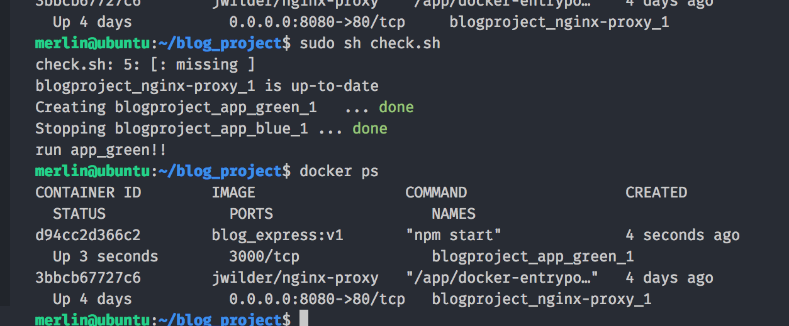

## Docker Depolyment

### blue-green 배포 개념
로드발란서를 앞단에 하나를 두고 v1 버젼인 블루(가칭) 라는 앱을 띄운다. 그러다가 나는 v2 버젼인 그린(가칭)을 무중단 방식으로 업데이트를 진행하고 싶다. <br>
그럴때 그린을 로드발란서에 등록을 시킨다. <br>
그러면 블루와 그린을 로드발란싱을 할텐데 그린이 완전히 정상작동을 하였을때 v1 버젼인 블루를 죽이는 방식이다.


### Environment
- 노트북 : 맥북
- 도커 호스트 : virtual box ubuntu
- 도커 컨테이너 : node express server , nginx-proxy

### local 폴더 구조

```
├── config                               
├── db
├── dockerfile
│   ├── Dockerfile_express
├── front
├── server
│   ├── server.js
├── .dockerignore
├── check.sh
├── docker-compose.yml
├── package.json
  
```


### Summary
1. 맥북 - virtual box 공유 폴더 구성
2. 폴더 구성 
3. ubuntu 에서 nginx-proxy 이미지 다운
4. ubuntu 에서 node 이미지를 기반으로 express Dockerfile_express 작성 및 빌드
5. docker-compose.yml 작성
6. check.sh 현재 돌아가는 도커 확인하고 새로운 도커 띄우고 현재 돌아가는 도커 죽이는 쉘 스크립트 작성
7. 테스트

### Execute

1. 버츄어 박스에 공유 폴더 설정
참고 : [http://theniceguy.tistory.com/13](http://theniceguy.tistory.com/13)

```sh
## 우분투에 공유폴더 마운트 
$ sudo mount --types vboxsf blog_project blog_project
```
- 로컬 blog_project 폴더를 버츄어박스의 blog\_proect 폴더랑 연결
- 버츄어 박스 내의 blog_proect 폴더안에는 도커에서 필요한 소스파일 및 설정파일들이 담겨져 있음.


2. 로드밸런싱을 위한 nginx-proxy 이미지 다운 받기 

```sh
## nginx-proxy 이미지 다운 받기 
$ docker pull jwilder/nginx-proxy 
```


- 해당 이미지는 도커 젠을 기반으로 만들어진 nginx-proxy로 로드발란싱의 기능이 있는 nginx applicaion에 도커 젠 기능을 추가 해서 넣은 이미지

- 해당 이미지를 사용하게 되면 도커 젠이 도커 데몬을 바라보고 있다가 컨테이너의 런 , 스탑 등의 이벤트를 감지, 해당 컨테이너 정보를 수집 해서 추가 작업을 할 수 있게 끔 도와준다. 여기서 추가작업은 nginx reverse proxy config 작업을 자동으로 수행할 수 있게 도와준다.

- 여기서 호스트의 docker.sock을 nginx-proxy 내부로 들고가야 하는데 이유는 호스트와 통신을 해야하기 때문이다. 호스트 서버에서 발생되는 도커 데몬의 이벤트를 바라보고 있다가 정보를 잘 받을수 있도록 통신을 해야한다.

- 여기서 nginx-proxy에 등록될 app 들은 VIRTUAL_HOST라는 환경변수를 등록 해야한다.

- nginx 의 가상 호스트 정보는 [https://opentutorials.org/module/384/4529](https://opentutorials.org/module/384/4529) 여길 참조


3. express 도커서버를 위한 도커파일 작성

```dockerfile
## express 를 위한 도커파일
FROM node:alpine
MAINTAINER  merlin@merlin.com

RUN mkdir -p /app
WORKDIR /app
COPY package*.json ./
RUN  npm install

EXPOSE 3000

```


4. 도커파일을 express 이미지로 빌드.

```sh

$ docker build -t blog_express:v1 -f ./dockerfile/Dockerfile_express: .

```

5. 모아둔 이미지들을 실행 

```yml
#docker-compose.yml

version: '3'

services:
  app_blue:
    image: blog_express:v1
    depends_on:
      - nginx-proxy
    working_dir: /app/
    ports:
      - 8888:3000
    environment:
      - VIRTUAL_HOST=nodeapp.local
    volumes:
      - front-volume:/app/front
      - server-volume:/app/server
    command: npm start
  
  app_green:
    image: blog_express:v1
    depends_on:
      - nginx-proxy
    environment:
      - VIRTUAL_HOST=localhost.app
    volumes:
      - front-volume:/app/front
      - server-volume:/app/server
      
    command: npm start

  nginx-proxy:
    image: jwilder/nginx-proxy
    ports:
      - 8080:80
    volumes:
      - /var/run/docker.sock:/tmp/docker.sock:ro
    

volumes:
  server-volume:
    driver: local-persist 
    driver_opts:
      mountpoint: /home/merlin/blog_project/server # full path 
  
  front-volume:
    driver: local-persist
    driver_opts:
      mountpoint: /home/merlin/blog_project/front # full path

```

** 브라우저에서 접근할시 VIRTUAL_HOST 에 설정했던 이름으로 접근할 것 <br>
nginx 설정에 server_name이 VIRTUAL\_HOST 에 설정했던 값이 박혀있기에 nginx는 해당 이름으로 접근할때 반응하게 된다. <br>
해서 /etc/hosts 설정은 필수


6. 블루-그린 배포를 위한 쉘 스크립트 작성

```sh
#check.sh

#!/bin/sh

EXIST_BLUE=$(docker ps | grep app_blue)

if [ -z "$EXIST_BLUE"]; then
    docker-compose up -d app_blue
    docker-compose stop app_green
    echo "run app_blue!!"
else
    docker-compose up -d app_green
    docker-compose stop app_blue
    echo "run app_green!!"
fi
```

- check.sh 를 작성해서 app_blue가 실행했을 경우에는 app\_green이 실행 후 app\_blue 를 중지.
- app_green 이 실행했을 경우에는 app\_blue를 실행 후 app\_green 를 중지.


7. test

```sh
# 처음에는 app_blue를 띄운다.
$ docker-compose up -d app_blue

# 그 다음부턴 무중단으로 .check.sh 를 실행
$ sudo sh check.sh

```



