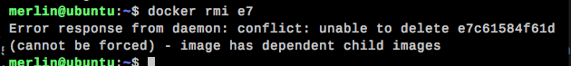
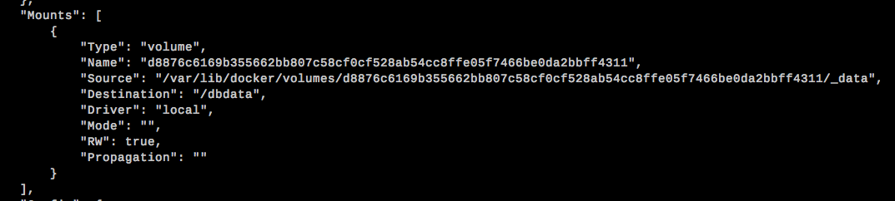
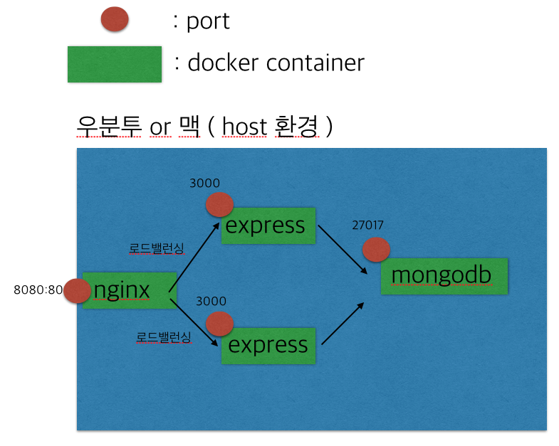

## Docker term
### What is Docker?

- 소프트웨어를 containerization(컨테이너화) 한 플랫폼. ( 웹서비스 컨테이너 , 디비 컨테이너 따로 담는다고 하면 서로 isolation 화 할수 있고 서로 독립적인 공간을 가질수 있다. 서로에게 영향을 주지 않을수 있다. )
- containerization 란 컨테이너를 매체로 한 수송체계, 즉. 컨테이너 규격을 맞춰 놓으면 차 , 배 , 비행기등 더 쉽고 빠르게 대량 수송과 시간을 단축 시킬수 있다. 라는 장점을 지니고 있음.
- 이걸로 유추해볼 때 도커는 다양한 SW들을 컨테이너에 담아 이동하기가 쉽게하고 포터블하게 만들수있는 플랫폼.
- 리눅스의 응용프로그램들을 소프트웨어 컨테이너 안에 배치시키는 일을 자동화 하는 오픈소스

### What is Container?

- 개발 , 배포 , 운용 등을 위해 표준화된 단위로 구성된 소프트웨어 패키지화 
- 호스트 pc의 커널을 공유하면서 SW가 돌아갈수 있는 모든 구성들이 들어가있다. 대신, 불필요한 것들은 들어있지 않다.
- 해당 도커 이미지를 run 시키면 해당 SW가 돌아가는데 그 상태를 컨테이너 라고 한다.
일종의 프로세스와 유사한 개념이다.
- 이 해당 컨테이너 내부 환경을 정의하는 파일은 dockerfile 이다.
- 나머지 시스템으로 부터 완전히 독립된 공간을 갖는다. 그래서 밖으로 통신하기 위해선 포트를 맵핑해야 한다.

### What is Service?

- 서비스는 app의 한 부분이다. 예를 들어 비디오를 공유하는 사이트는 데이타 베이스에 app data를 저장하는 서비스, 비디오 업로드 후 transcoding 하는 서비스 등등..
- 서비스들은 실제로 production의 컨테이너들로 구성된다.
- 하나의 서비스는 하나의 이미지만 실행하지만 그 이미지를 실행하는 방법을 쳬계화 할 수 있습니다. 그 체계화는 docker-compose.yml 파일에서 설정 할 수 있다. 
- docker-compose.yml 파일에서는 어떤 포트를 사용해야하는지, 서비스가 가져가야 할 필요한 용량에 따라 얼마나 많은 복제 컨테이너를 실행시켜야 하는지, 서비스를 위해 얼마나 컴퓨팅 리소스를 할당할지를 설정 할 수 있다.
- docker-compose.yml 을 이용 하면 이미지를 일일이 다 run 시키지 않아도 된다. 


### What is Image?

- 도커 이미지란 서비스의 필요한 프로그램 , 라이브러리, 소스등을 설치한 뒤에 이를 파일로 만든 것이다. 쉽게 실행파일이라고 생각하면 된다.
- 이미지를 만들기위해 dockerfile에 필요한 명령들을 설정해 놓는다.
- 이미지는 base image 와 parent image 로 나뉜다.
- base image 는 parent image가 없는 이미지를 말한다.
- parent image 는 사용하는 이미지의 Dockerfile 내에 FROM 으로 지시되는 이미지이다. 만약 Dockerfile 내에 FROM 이 지시되어있지 않다면 부모 이미지가 없는것이고 이는 곧 base image 가 된다.
- Dockerfile로 이미지를 만들때는 전에 만들었던 이미지 캐시를 잘 이용해야 한다. 기존 방식은 한줄 한줄 실행하면서 <br><b>임시 컨테이너 생성 > 명령어 수행 > 이미지 저장 > 임시 컨테이너 삭제 > 새로 만든 이미지 기반 임시 컨테이너 생성 > 명령어 수행 > 이미지로 저장 > 임시 컨테이너 삭제...</b> 이런식으로 수행....


----> {해쉬아이디} : 이미지 저장 <br>
----> Running in {해쉬아이디} : 명령어를 수행하기 위해 그 전 이미지 기반으로 임시 컨테이너 생성

< 처음 Dockerfile 돌렸을때 >


< 기존 Dockerfile을 2번째 돌렸을때 >


< 기존 Dockerfile 에서 EXPOSE 80 에서 EXPOSE 81로 변경했을 때 >


- 이미지 생성시 FROM에 적어둔 parent image기반으로 변경사항만 따로 저장되는게 장점. vm 처럼 용량을 많이 먹지 않음. <br>
따라서 parent image 기반으로 새로운 이미지를 만들고 parent image 를 삭제하려고 했을때 에러 뜸.



### What is Stack?

---
## Docker Structure


*출처 : [http://www.leafcats.com/146](http://www.leafcats.com/146)*

---
## Docker Install

[공식 홈페이지 참조](https://docs.docker.com/engine/installation/)

---
## Docker use

도커 허브에서 원하는 이미지를 다운 받을 수 있다.
[도커 허브](https://hub.docker.com/)

```sh
$ docker --help
```
도커의 명령어를 살펴볼 수 있다.

```sh
$ docker pull nginx:latest
or
$ docker run -d -it \
--name merlin-nginx \ 
-p 8080:80 \
nginx:latest

```

pull을 하면 해당 이미지만 받는것이다 <br>
run을 실행하게 되면 local에 nginx:latest 라는 이미지가 없으면 자동으로 hub에서 다운받아서 run 을 시킨다.

```sh
$ docker images
$ docker ps
$ docker ps [-a] [-l] [-n number]

```
images 는 도커 이미지 리스트를 살펴볼 수 있다. <br>
ps 는 실행중인 컨테이너 리스트를 볼 수 있다. <br>
-a 옵션을 붙이면 종료된 목록까지 볼 수 있다.<br>
-l 옵션은 마지막 실행했던 목록 , -n 은 리눅스의 tail 명령어와 동일하다.

```sh
$ docker commit -a "merlin <merlin@kakaocrop.com>" -m olympic-search-pc naughty_torvalds search.daum.pc:olypic
```
현재 돌아가고 있는 컨테이너를 이미지로 만들 수 있다.<br>
 -a 옵션 : author , -m : 커밋 메세지 , <naughty_torvalds> 들어가는 부분 : 지금 동작하고 있는 컨테이너 이름 , <search.daum.pc:olypic> 새로운 이미지 네임과 태그


```sh
$ docker rm <컨테이너 이름>
$ docker rmi <이미지>
# 한번에 처리.
$ docker rm $(docker ps -a -q)
```
도커 이미지와 컨테이너 삭제

```sh
$ docker start <컨테이너 이름>
$ docker stop  <컨테이너 이름>
$ docker restart <컨테이너 이름>
```
도커 컨테이너 실행 , 중지 , 재부팅

```sh
$ docker attach <실행중인 컨테이너 이름> 
$ docker exec -it <실행중인 컨테이너 이름> <컨테이너 안에서 실행할 명령>
$ docker exec -it merlin-nginx /bin/bash
```
attach는 실행중인 도커 컨테이너에 접속한다. 단, ps 쳤을때 command 에 /bin/bash 라고 쳐져있어야 자유롭게 입력할 수 있다. 그렇지 않으면 입력은 할 수 없고 출력만 보인다. <br>
exec는 컨테이너 안에서 수행할 명령을 날려줍니다. -it 옵션을 주면 실행된 bash 쉘에서 입력 및 출력을 할 수가 있습니다.

```sh
$ docker inspect <컨테이너 이름 or 이미지:태그>
```
이미지 또는 컨테이너의 세부정보를 출력합니다.

```sh
$ docker history <이미지:태그>
```
이미지의 히스토리를 조회

```sh
$ docker diff <실행중인 컨테이너 이름>
```
컨테이너가 실행되면서 변경된 파일 목록을 출력합니다. 비교 기준은 컨테이너를 생성한 이미지 내용입니다.

```sh
$ docker cp <컨테이너 이름>:<경로> <호스트 경로>
```
컨테이너에서 파일을 꺼내기.


---
## Docker build

```sh
$ docker [OPTIONS] PATH | URL | -
$ docker build -t app .
```
-t 옵션은 생성할 이미지 이름을 지정합니다. 

### Dockerfile
```Dockerfile
# 어떤 이미지로부터 새로운 이미지를 생성할지를 작성
# 베이스를 지정
FROM node:argon

# Dockerfile 을 관리하는 사람의 이름 
MAINTAINER < merlin.ho > merlin@merlin.com
# /app directory 생성
RUN mkdir /app

# /app directory를 WORKDIR로 설정
WORKDIR /app

# 현재 경로에 있는 package.json을 /app에 복사
COPY package.json /app

# src에 파일 대신 url을 입력할수 있고 압축 파일의 경우 압축을 해제하면서 복사
ADD < src > < dest >
ADD . /usr/src/app

# 내부적으로 /bin/sh -c 실행 뒤 npm install 을 실행
RUN npm install

# 현재 Dockerfile 이 있는 경로의 모든 파일을 /app 에 복사함
COPY . /app

# 가상머신에 오픈할 포트넘버
EXPOSE 3000

# 도커 컨테이너가 실행 되었을때 실행되는 명령 지정, 빌드할때는 실행되지 않으며 여러개의 CMD가 존재할 경우 가장 마지막 것만 실행 됩니다.
# 한꺼번에 여러 개의 프로그램을 실행하고 싶은 경우에는 run.sh파일을 작성하여 데몬으로 실행하거나 supervisord나 forego와 같은 여러 개의 프로그램을 실행하는 프로그램을 사용합니다.
CMD ["npm", "start"]
```


### recommendation Dockerfile

1. Containers should be ephemeral
    - Ephemeral environments are also sometimes called “Dynamic environments”, “Temporary environments”, “on-demand environments” or “short-lived environments”.
    - static environments와 반대되는 개념이다.
    - 이것이 의미하는 바는 이 컨테이너를 우리가 stop and destroy 할 수 있고 새롭게 built 할 수 있으며 최소한의 셋팅과 설정으로 원하는 장소에 올려 놓을수 있다 라는것을 뜻함.
    - 그래서 항상 production 환경과 같은 환경에서 test를 진행할 수 있다. test도 하나의 이미지를 공유 함으로써 병렬로 진행 할 수 있다.

2. Use a .dockerignore file
    - 우리는 docker build 커멘드를 치는 장소를 build context 라고 부른다. 
    - 디폴트로 현재 디렉토리라고 가정하지만 구체적인 다른 디렉토리를 가리키려면 -f flag를 사용해야한다.
    - 현재 디렉토리의 파일과 여러 디렉토리들을 docker deamon 에게 build context로 보내지게 되는데 이 이것은 무심코 이미지 결과로 보내지게 되어 이미지 파일이 커지게 된다.
    - 따라서 .gitignore와 비슷하게 .dockerignore 파일을 사용해서 관계없는 파일들을 exclude 시킬수 있다.
3. Use multi-stage builds
    - Docker 17.05 버전 이상에서는 multi-stage builds 로 최종 이미지 사이즈를 줄일 수 있다.
    - multi-stage builds 란 Dockerfile 안에서 multiple FROM 구문을 사용하면 각각의 새로운 stage가 빌드 되고 한 stage에서 나온 결과 산출물을 또다른 stage로 카피를 할 수 있다. 따라서 중간 산출물을 위해 Dockerfile을 여러개 만들어서 중간 이미지를 만들고 하는 복잡한 과정을 거치지 않아도 된다.
    - dockerfile을 작성할때 자주 바뀌지 않은 것부터 자주 바뀌는 순으로 작성을 한다.

4. Avoid installing unnecessary packages
    - 불필요한 패키지는 인스톨을 피해라.
    - 예를 들면 데이타베이스 이미지에 text editor 를 추가시킬 필요는 없다.
5. Each container should have only one concern
    - 하나의 컨테이너는 오직 하나의 일만하게 시켜라.
    - 응용 프로그램을 여러 컨테이너로 분리하면 가로로 확장하고 컨테이너를 다시 사용하는 것이 훨씬 쉬워집니다. 
    - 컨테이너를 깨끗하고 가능한 모듈화 시킬 수 있는 최고의 판단을 해라.
    - 만약 컨테이너 각각이 의존성을 띄고 있다면 Docker network를 사용하면 컨테이너끼리의 커뮤니케이션을 할 수 있다.
6. Minimize the number of layers
7. Sort multi-line arguments
8. Build cache


---
## 10 things to avoid in docker containers
    1. Don’t store data in containers
    2. Don’t ship your application in two pieces
    3. Don’t create large images
    4. Don’t use a single layer image
    5. Don’t create images from running containers
    6. Don’t use only the “latest” tag
    7. Don’t run more than one process in a single container 
    8. Don’t store credentials in the image. Use environment variables
    9. Don’t run processes as a root user 
    10. Don’t rely on IP addresses 

*출처 : [https://developers.redhat.com/blog/2016/02/24/10-things-to-avoid-in-docker-containers/](https://developers.redhat.com/blog/2016/02/24/10-things-to-avoid-in-docker-containers/)*

---
## Docker manage app data

1. 호스트의 지정된 폴더를 컨테이너에 다이렉트로 마운트 
```sh
$ docker run --name merlin_ubuntu -d -v <호스트 폴더경로>:<마운트될 컨테이너 폴더경로> -it ubuntu:14.04
```

2. volume container 사용

```sh
# 볼륨 컨테이너를 만든다. busybox 기반 정말 리눅스의 최소 기반만 가지고 있다. 1.14MB
$ docker run -v /dbdata --name dbdata busybox

# 볼륨 컨테이너를 우분투 컨테이너에 연결
$ docker run --volumes-from=dbdata -it ubuntu:14.04 /bin/bash

# 빽업도 진행할 수 있다.
$ docker run —volumes-from dbdata -v $(pwd):/backup ubuntu tar cvf /backup/backup.tar /dbdata
```

3. use volume

- 보통 standalone 컨테이너에는 -v 또는 --volume 옵션을 사용했고, swarm service 에는 --mount 옵션을 사용해 왔지만
17.06 이후 버젼부터는 standalone 컨테이너에서 모두 사용이 가능하다.
- 만약 볼륨드라이버의 구체적인 옵션을 셋팅해야 한다면 --mount 옵션을 사용해라.
- -v 또는 --volume 옵션은 도커 호스트에 파일 또는 디렉토리가 없을 경우 자동으로 생성해주지만 --mount 옵션은 자동으로 생성해주지 않는다 대신 에러를 뿜는다.
- -v 또는 --volume 은 세가지 field 를 가질수 있다 첫번째는 호스트 머신의 볼륨 이름이고 랜덤한 볼륨을 생성하고 싶다면 생략해도 된다. 두번째는 컨테이너 안에 생성될 디렉토리 또는 파일 path이다. 세번째는 옵션으로 콤마(:)로 옵션을 나열할 수 있다. 예를 들면 ro(readonly) 옵션등이 있다.
- --mount 는 key=value 로 구성을 하고 key 에는 type, src or source , dst or target , volume-opt 등이 있다.
- type의 경우에는 bind , volume , tmpfs 가 있으며 이번 주제는 우선 volume 이므로 타입은 volume 으로 한다.


```sh
$ docker volume create my-vol
$ docker volume ls
# Remove a volume:
$ docker volume rm my-vol
```

```sh
#컨테이너 연결 
# mount 방법
$ docker run -d \
  -it \
  --name devtest \
  --mount source=myvol2,target=/app \
  nginx:latest

  $ docker run -d \
  -it \
  --name=nginxtest \
  --mount source=nginx-vol,destination=/usr/share/nginx/html \
  nginx:latest

# -v 방법 
 $ docker run -d \
  -it \
  --name devtest \
  -v myvol2:/app \
  nginx:latest 


  $ docker run -d \
  -it \
  --name=nginxtest \
  -v nginx-vol:/usr/share/nginx/html \
  nginx:latest
```


마운트 된 경로는 inspect 명령어로 알아 볼 수 있다.



결론은 어찌되었건 호스트에 데이타를 연동 시킨다. <br>
volume container 를 사용했을 떄 데이터도 컨테이너로 관리를 할 수 있다. 그럼..컨테이너의 장점을 다 이용할 수 있지 않을까...


---
## Docker compose

docker compose install 
[docker compose install](https://docs.docker.com/compose/install/#install-compose)

version 3 

```yml
# compose 버젼 3을 이용하겠다. 대소문자 주의
version: '3'

services: 
    webapp:
        build: ./dir # 구체적인 빌드 컨텍스트의 경로를 지정할 수 있다. 도커 파일을 포함하는 디렉토리나 깃 레파지토리 url, 
        build: # 또는 구체적인 옵션들을 설정할 수 있다. 
            context: ./dir
            dockerfile: Dockerfile-alternate
            args: # 빌드 프로세스 진행중에 사용할 환경 변수들을 지정할 수 있다.
                buildno: 1
            cache_from: # v3.2지원 엔진이 캐시로 사용할 이미지들
                - alpine:latest
                - corp/web_app:3.14
        command: bundle exec thin -p 3000  # 디폴트 커멘드를 오버라이딩
        container_name: my-web-container # 컨테이너 이름
        # 버전 3부터는 depend_on 안에 condition은 지원하지 않는다.
        depends_on: # 서비스들 간에 의존성을 표현, 이것은 db, redis 이후에 webapp 이 실행하게 된다.(compose up시)
            - db
            - redis
        tmpfs: /run # 컨테이너에 임시 파일 시스템을 마운트 , 리스트로 작성해도 된다. 
        entrypoint: /code/entrypoint.sh # 도커 파일의 엔트리 포인트를 오버라이딩 , 리스트로 작성해도 된다. 
        env_file:  # 환경변수들을 파일로 받는다. 이 환경 변수 파일들은 각각 라인마다 VAR=VAL 포멧으로 작성한다. #은 주석
            - ./common.env
            - ./apps/web.env
            - /opt/secrets.env
        environment: # 환경변수 추가. 어떤 boolen 값들은 quotes로 감싼다.
            RACK_ENV: development
            SHOW: 'true'
            SESSION_SECRET:
        expose: # 포트 노출 
            - "3000"
            - "8000"
        external_links: # 링크 컨테이너 docker-compose.yml 외부에 있는 컨테이너 , CONTAINER:ALIAS 
            - redis_1
            - project_db_1:mysql
            - project_db_1:postgresql
        extra_hosts: # /etc/hosts 에 추가 
            - "somehost:162.242.195.82"
            - "otherhost:50.31.209.229"
        image: redis # 특별한 이미지로 부터 런 , 이미지가 없으면 pull 한다.
        healthcheck: # 이 서비스를 위해 건강한지 체크 , 이미지로 부터 어떤 디폴트 헬스체크를 disable 하려면 disable: true 추가 
            test: ["CMD", "curl", "-f", "http://localhost"]
            interval: 1m30s
            timeout: 10s
            retries: 3
        labels: # 라벨 추가. 
            com.example.description: "Accounting webapp"
            com.example.department: "Finance"
            com.example.label-with-empty-value: ""
        links: # 다른 서비스들의 컨테이너 들과 연결고리를 형성, SERVICE:ALIAS , 주의!! --links 플래그는 레거시 이다. --links 사용을 대신해서 사용자가 정의하는 네트워크 설정을 이용하길 권장한다.
            - db
            - db:database
            - redis
        logging: # 서비스의 로깅 config
            driver: syslog # json-file , syslog , none
            options:
                syslog-address: "tcp://192.168.0.42:123",
                max-size: "200k" # json-file 의 경우 로그 저장을 제한할 수 있다. 오래된 파일은 지워진다. 
                max-file: "10"
        network_mode: bridge # 네트워크 모드 설정 , host , none , service:[service name] , container:[container name/id] //// host 모드는 links랑 같이 사용할 수 없다. 
        networks: # top level 에서 지정한 네트워크 설정 , 알리아스를 사용할 수 도 있다. 이 알리아스 네임으로 서비스를 연결 할 수 있다.
            - some-network
            - other-network
            new: 
                aliases:
                    - database
        ports: # HOST:CONTAINER
            - "8000:8000"
        volumes: # 호스트 경로 또는 생성된 볼륨을 마운트 시킨다. 
            - type: volume
            source: mydata
            target: /data
            volume:
                nocopy: true
            - type: bind
            source: ./static
            target: /opt/app/static
        

volumes:
  mydata:
    external : true # 컴포즈 밖에 volume이 존재했을때, 없으면 'docker volume create --name=' 으로 만들라고 에러뜸.
    name : actual-name-of-volume # 이름을 지정할 수도 있다.
  dbdata:

networks: 


```


---
## Docker Configuration



< 이미지 준비 >
1) nginx
2) express
3) mongodb

```sh
## 이미지 다운 받기 nginx 랑 mongodb
$ docker pull nginx:latest && docker pull mongo:latest
## express 의 기반이 될 node image 받기
$ docker pull node:alpine
```

```dockerfile
## mongodb data를 저장할 image
FROM busybox
MAINTAINER <merlin> merlin@merlin.com
VOLUME /app/
CMD /bin/sh
```

```dockerfile
## express 이미지 만들기
FROM node:alpine
MAINTAINER <merlin> merlin@merlin.com

RUN mkdir /app
WORKDIR /app
COPY package.json /app
RUN  npm install

EXPOSE 3000
```


---
## Docker network

출처 : [http://bluese05.tistory.com/15](http://bluese05.tistory.com/15)

### network 구성

- 도커를 설치 하면 docker host 쪽에 보면 **docker0** 이라는 virtual ethernet bridge를 확인할 수 있다. ( $ ifconfig 로 확인가능, 난 172.17.0.1 로 셋팅되어 있다.)
- docker0는 container가 통신하기 위한 가상 linux bridge 이다. bridge는 기본적으로 L2 통신 기반이다.
- 컨테이너가 하나씩 생성되면 이 bridge에 하나씩 바인딩 된다. ( $ brctl show docker0 )
- 이렇게 연결된 컨테이너와 host는 케이블로 연결한 두대의 pc라고 보면 된다.
- 컨테이너 내부의 eth0 인터페이스는 내부로 격리되어있어서 이 내부와 host를 이어줄 vethxxxx 형태의 인터페이스가 하나 더 존재한다. 이 인터페이스가 host와 컨테이너 사이를 연결해준다. 
- 컨테이너 내부의 아이피를 확인하려면 ifconfig eth0 라고 치면 되는데 ifconfig 가 잘 안먹는다. 그럴땐 도커 inspect로 확인하자.


### network 방식

```sh
# 네트워크 방식 확인하기 ( 드라이버 ) bridge , host , none ( 네임 기준 )
$ docker network ls
```
```sh
# 기본 네트워크는 bridge 방식이다.
# 다른방식으로 컨테이너를 생성하고 싶다면
$ docker run --new={네트워크 타입}

```

1. birdge
    - 네트워크에서 브릿지란 호스트 서버의 네트워크를 연결하여 가상화된 머신들도 동일한 네트워크를 사용하도록 하는 것이다.
    - docker network inspect bridge 로 브릿지 모드의 자세한 내용을 확인 할 수 있다.

2. host 
    - 이 방식은 컨테이너가 독립적인 네트워크 영역을 갖지 않고 host와 네트워크를 함께 사용한다.
    - 따라서 해당 컨테이너는 host의 네트워크 정보와 동일시 하게 가져가게 된다.
    - 따라서 docker0 에 바인딩 되지 않는다. 

3. container 
    - 다른 컨테이너의 네트워크 환경을 가져온다. 즉, ip와 mac 주소를 동일시 하게 구성한다.
    - docker run --name web03 --net=container:{컨테이너 id} -d nginx:alpine

4. none
    - 이 옵션은 격리된 네트워크 환경은 갖지만, 인터페이스가 없는 상태로 컨테이너를 생성하게 된다.

### container 외부 통신

- 각 컨테이너는 격리된 환경에서 각각의 mac 주소와 ip 주소를 부여 받는다. 
- 각 컨테이너들은 host와 통신하기 위해 bridge 방식으로 바인딩 되어있는데 각 부여받은 ip로 자유롭게 통신 가능.
- 예를 들면 web 서비스를 하는 container 는 80번 포트에서 리스닝을 하고있다. 이 포트는 외부와 통신이 되어야 하는데 이때 포트를 외부로 지정한다. -p 8080:80 으로 옵션을 주게 되면 docker host의 8080 포트로 요청이 들어오면 컨테이너의 80 포트로 해당 요청을 forwarding 하겠다는 의미이다.
- docker ps -a or netstat -nlp | grep 8080 로 확인

### link 방식의 한계

- link 방식은 하나의 호스트 사이에서 실행되는 컨테이너 사이에서만 연결이 가능하다.
- 다수의 host가 존재했을때, 다른 host의 컨테이너에는 접근할 수가 없다.
- 이 경우 docker swarm 같은 orchestration 툴을 사용하거나 dynamic DNS를 구축해야한다.

** dynamic DNS 란?
    - 간단하게 ip 가 바뀌면 그걸 알아채서 외부 DNS 서버에 알려준다. 그러면 ip가 동적으로 바뀌는 환경에서도 사용자는 바뀐 ip를 알 필요 없이 domain name 만 알면 동일하게 접속 할 수 있다.


