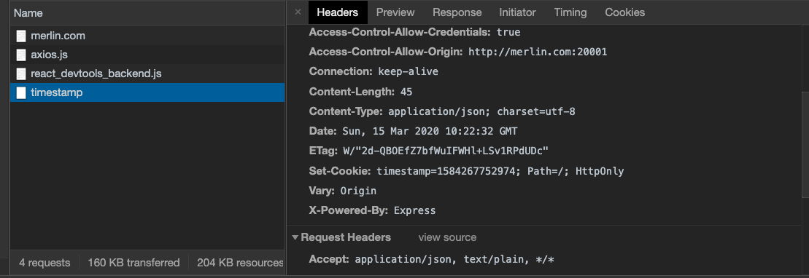
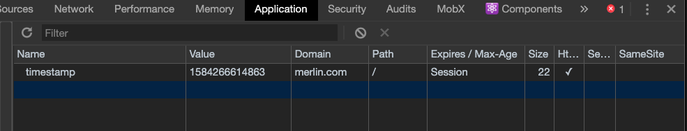
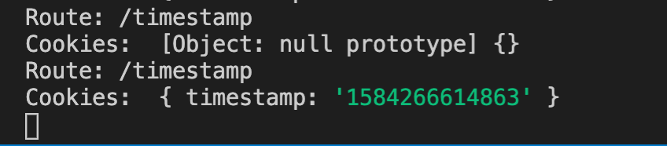
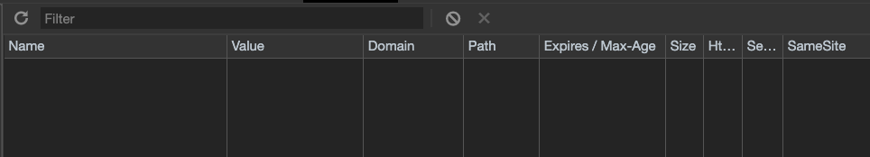
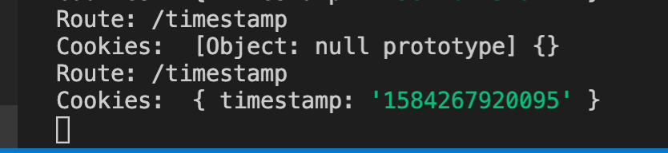
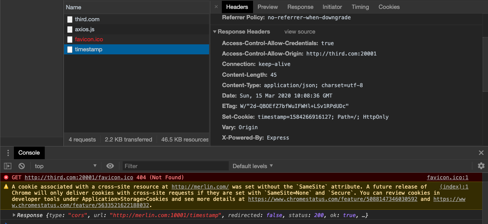
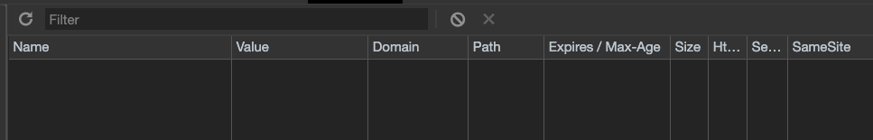
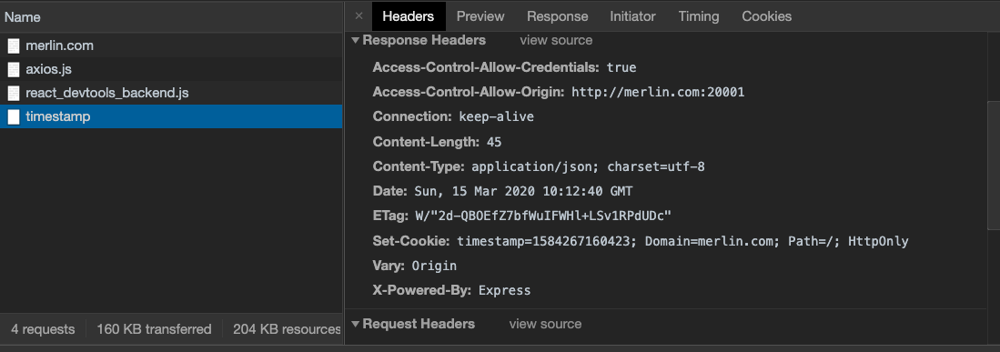
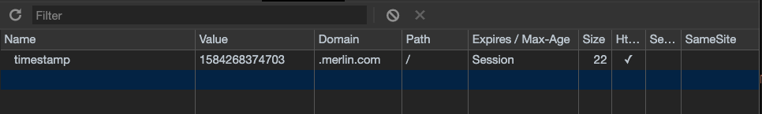
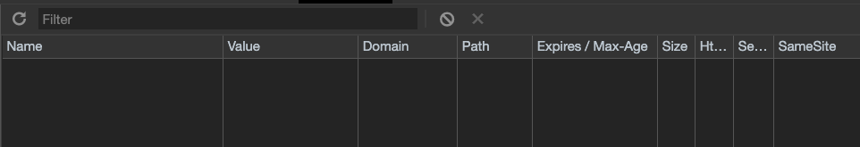

## 동기

크롬 브라우저(v80) 에서 서브 도메인에 post 요청 시에 응답헤더로 Set-Cookie 가 설정되어서 오지만,
크롬 dev tools의 application > cookie 로는 저장되는 모습을 볼 수가 없었습니다.

하여 몇가지 테스트를 진행 해보고 파악을 해보려고 합니다.

## 준비

- 크롬 브라우저 (v80) : 모든 쿠키가 다 삭제된 상태
- web API 서버 : `merlin.com:10001` (cors 설정)
- 각각 다른 도메인 서버
  - `merlin.com:20001` (first-class 도메인)
  - `sub.merlin.com:20001` (서브 도메인)
  - `third.com:20001` (third-party 도메인)

### 코드 준비

#### API SERVER

```javascript
const express = require("express");
const fs = require("fs");
const cors = require("cors");
var cookieParser = require("cookie-parser");

const app = express();
const whiteList = [
  "http://merlin.com:20001",
  "http://sub.merlin.com:20001",
  "http://third.com:20001"
];

const corsOptions = {
  origin: function(origin, callback) {
    callback(null, whiteList.indexOf(origin) > -1);
  },
  methods: "POST",
  credentials: true
};
app.use(cors(corsOptions));
app.use(cookieParser());

app.post("/timestamp", function(req, res) {
  console.log("Route: /timestamp");
  console.log("Cookies: ", req.cookies);

  res.cookie("timestamp", new Date() * 1, {
    // domain: "merlin.com",
    httpOnly: true,
    path: "/"
  });
  res.send({
    result: "true",
    message: "success request"
  });
});

app.listen(10001);

console.log("Running API SERVER...");

```

#### WEB SERVER

```javascript
const express = require("express");
const fs = require("fs");

const app = express();

app.get("/", function(req, res) {
  fs.readFile("index.html", function(error, data) {
    if (error) {
      res.send("Page not found.");
    } else {
      res.writeHead(200, { "Content-Type": "text/html" });
      res.end(data);
    }
  });
});

app.listen(20001);

console.log("Running WEB SERVER...");
```

#### API 호출 로직

```javascript
const apiUri = 'http://merlin.com:10001/timestamp'

function getTimestamp() {
  fetch(apiUri, {
    method: "POST",
    headers: {
      "Content-Type": "application/json;charset=UTF-8"
    },
    credentials: 'include',
  }).then(res => res)
    .then(console.log)

  //  axios(
  //   {
  //     method: 'POST',
  //     url: apiUri,
  //     withCredentials: true,
  //   },
  // ).then(console.log)
}
```

## 실험방법

1. 크롬 브라우저로 각 다른 도메인에 접근 합니다.

2. 버튼을 눌렀을때 `merlin.com:10001`로 post method 호출을 보냅니다. ( axois, fetch )

3. `merlin.com:10001` 에는 응답으로 쿠키를 보내봅니다. ( 쿠키에 도메인 설정 함 vs 쿠키에 도메인 설정을 안함 )
  
4. 크롬에서 쿠키가 잘 쌓이는지 확인합니다.  

5. 한번 더 요청 시 저장된 쿠키가 서버로 잘 날라가는지도 확인합니다.

6. 도메인 및 환경이 달라질 때마다 쿠키는 삭제해 줍니다.

## 실험 (쿠키에 도메인 설정 안함)

### 1차 도메인 fetch 방법(merlin.com:20001)

[header Set-Cookie]


[chrome dev tools]


[서버로 들어온 쿠키]


### 1차 도메인 axois 방법(merlin.com:20001)

[header Set-Cookie]



[chrome dev tools]


[서버로 들어온 쿠키]


### 서브 도메인 fetch 방법 (sub.merlin.com:20001)

[header Set-Cookie]


[chrome dev tools]



[서버로 들어온 쿠키]



### 서브 도메인 axios 방법 (sub.merlin.com:20001)

[header Set-Cookie]


[chrome dev tools]



[서버로 들어온 쿠키]



### 3자 도메인 fetch 방법(third.com:20001)

[header Set-Cookie]



[chrome dev tools]


[서버로 들어온 쿠키]


### 3자 도메인 axios 방법(third.com:20001)

[header Set-Cookie]


[chrome dev tools]



[서버로 들어온 쿠키]


## 실험 쿠키에 도메인 설정 함 (domain: 'merlin.ho')

### 1차 도메인 fetch 방법(merlin.com:20001)

[header Set-Cookie]



[chrome dev tools]


[서버로 들어온 쿠키]


### 1차 도메인 axios 방법(merlin.com:20001)

[header Set-Cookie]


[chrome dev tools]


[서버로 들어온 쿠키]


### 서브 도메인 fetch 방법(sub.merlin.com:20001)

[header Set-Cookie]


[chrome dev tools]


[서버로 들어온 쿠키]


### 서브 도메인 axios 방법(sub.merlin.com:20001)

[header Set-Cookie]


[chrome dev tools]



[서버로 들어온 쿠키]


### 3자 도메인 fetch 방법(third.com:20001)

[header Set-Cookie]


[chrome dev tools]


[서버로 들어온 쿠키]


### 3자 도메인 axios 방법(third.com:20001)

[header Set-Cookie]


[chrome dev tools]



[서버로 들어온 쿠키]


## 정리

- 일단 이유는 모르겠으나 `axios` 요청시 응답으로 쿠키에 도메인 없이 `Set-Cookie`를 하게 되면 크롬 dev tools에 보이지 않는다.
- 하지만 재 요청시 서버에 저장되있던 쿠키가 넘어가는 것으로 보아 쿠키가 저장이 되고 있는 사실을 알 수 있었다.
- `axios` 요청시 응답 쿠키에 도메인이 설정이 되어 있어도 `3자 도메인`에는 크롬 dev tools에 보이지 않는다. 하지만 쿠키는 저장되는 것을 알 수 있다.
- 크롬에서 최근에 `SameSite`가 default 값이 `Lax` 값으로 바뀐 이유 때문에 `3자 도메인`에 `Post` 요청시 경고가 콘솔창에서 뜹니다. (SameSite가 None이 아니면 전송이 안된다. Secure 설정도 필수.) 하지만 아직은 서버에 쿠키가 잘 전달 되는 것으로 보아 강제하지 않는거 같다.
